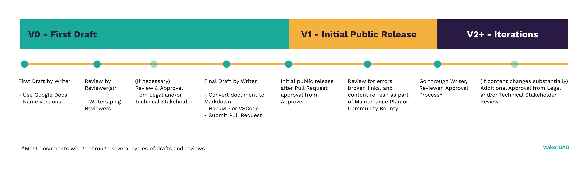

# Contributor Onboarding Guide

This onboarding guide walks new members through the ins and outs of contributing to MakerDAO through Community Development (Comm-Dev). Writers, designers, editors, developers, and anyone with relevant skill sets are welcome to participate.

Get started with a few initial steps:

- [Learn About MakerDAO](#learn-about-makerdao)
- [Explore Ways to Earn as a Contributor](#explore-ways-to-earn-as-a-contributor)
- [Express Interest](#express-interest)
- [Get Started](#get-started)
  - [Roles](#roles)
  - [Types of Projects](#types-of-projects)
- [Work on a Project](work-on-a-project)
  - [Community Guides](#community-guides)
  - [Typical Workflow](#typical-workflow)

## Learn About MakerDAO

Invest some time in gaining a well-rounded knowledge of MakerDAO and help make better contributions.

- Study the [Onboarding Guides](../onboarding/README.md) and [MCD FAQs](../makerdao-mcd-faqs/README.md) to understand the Maker Protocol on a technical level.
- [Learn how the protocol is managed through governance.](./governance/README.md)
- Take advantage of [Awesome-MakerDAO](https://github.com/makerdao/awesome-makerdao) to become familiar with MakerDAO’s history, current events, and the latest relevant information.

## Explore Ways to Earn as a Contributor

MakerDAO is ever-growing. Comm-Dev invites contributors to explore the [many ways to earn as a contributor](./earn-as-a-contributor.md) by finding tasks that match their skills and interests.

- [Build Onboarding Guides](/onboarding/README.md)
- [Organize Meetups](/meetups/README.md)
- [Improve Meetup Guides](/meetups/README.md)
- [Add to MakerDAO FAQs](/makerdao-mcd-faqs/README.md)
- [Translate MakerDAO Resources](/translations/README.md)
- [Write Risk & Governance Meeting Summaries](/gnr-summary-guide.md)
- [Curate Awesome-MakerDAO](https://github.com/makerdao/awesome-makerdao)
- [Participate in a Hackathon](/hackathons/README.md)
- [Explore open bounties with Help-Wanted label](https://github.com/makerdao/community/projects/2?card_filter_query=label%3A%22help+wanted%22) or [Browse Help-Wanted section of the MakerDAO Forum](https://forum.makerdao.com/c/comm-dev/help-wanted/11)
- [Propose initiatives with a Community Development Improvement Proposal (CDIP)](/contributor-onboarding-guide.md)
- [Apply for a Development Grant for a Large Project](/grants/README.md)

## Express Interest

- Join the [#community-development](https://chat.makerdao.com/channel/community-development) channel on MakerDAO’s chat.
- If a contribution does not fall within these scopes, discuss personal interests and relevant skills to the Contributing Team to help determine a well-suited project.
- Provide relevant examples of past projects, work, and experience.
- Resumes are appreciated, but not required.
- Demonstrate a reliable work ethic and offer quality work that speaks for itself.
- In-depth knowledge is appreciated but not required.
- Stand out by suggesting projects and adding insight to public discussions.
- Technical assignments are reserved for contributors that have the required background knowledge or skills.

## Get Started

Learn about the existing Community Development (Comm-Dev) contributor framework.

### Roles

Comm-Dev contributors assume various roles throughout the process of creating and working on MakerDAO’s community resources and initiatives. As projects evolve, contributors often take turns assuming the roles of Advisor, Lead, Writer, and Reviewer.

**Approver**

Approvers review final Comm-Dev submissions and have the authority to approve completed projects or request further revisions.

- Approvers are responsible for providing clear expectations for project completion.
- Approvers are defined at the onset of new projects.
- Projects may have more than one Approver at any given stage.
- Approvers must be comfortable reviewing Pull Requests for GitHub submissions.
- **\*Note:** The Approver role is not openly available to anyone.\*
  - _Generally, Approvers are domain experts, vetted or experienced members, or stakeholders._

**Lead**

A Lead spearheads Comm-Dev projects. Functionally, Leads act as project owners.

- A Lead is responsible for:
  - Defining a plan and project roadmap.
  - Providing updates.
  - Setting up GitHub issues.
  - Coordinating with stakeholders.
  - Generally overseeing projects and ensuring that they run smoothly.
- New Leads should turn to an Advisor for support.

**Advisor**

An Advisor is a supporting role that assists Leads throughout a project’s process to help bring it to completion.

- An Advisor:
  - May be tasked with helping onboard new contributors.
  - Should be well versed with any processes they provide support for.
  - May act as a temporary project manager.
  - Should consider an individual contributor’s strengths and abilities to help assign appropriate projects or tasks.
- One of the Advisor’s main goals is training contributors to ensure that they manage the responsibilities of their roles effectively.

**Writer**

A Writer produces Comm-Dev content and resources.

- Writers should be well versed with the [Writing Style Guide.](./writing-style-guide.md)
- Some projects will require coordination between multiple Writers.
- Contributors can assume either the Writer or Reviewer role, but not for the same project.

**Reviewer**

A Reviewer assesses written content for formatting and grammatical errors, consistency, and tone.

- Reviewers should be well versed with the [Reviewer](./reviewer-guide.md) and [Writing Style](./writing-style-guide.md) Guides.
- Reviewers are responsible for communicating changes and the reasons behind them to the Writer(s).
- Reviewers should give constructive feedback and convey any mistakes to the Writer(s).
- Documents may have multiple Reviewers at any given stage.
- Contributors can assume either the Writer or Reviewer role, but not for the same project.

**Contributing Team**

A Contributing Team is a core group of contributors responsible for a given ongoing Comm-Dev project.

- A Contributing Team may consist of a Designer, Writer, Reviewer, and Approver, for example.
- Small projects may have temporary Contributing Teams.
- Established Contributing Teams that work well together may oversee larger projects.

### Types of Projects

Many Comm-Dev projects are cross-functional with unique workflows, but they generally fall into three main categories: Resources, Initiatives, and Workflow.

#### Resources

Comm-Dev resource materials are classified into two main categories: Educational and Reference. Projects with defined categories give content creators direction, however, some resources may fall into overlapping resource categories (e.g., Onboarding Guides). The Contributing Team will decide whether a project is an Educational or Reference resource. Writers and Reviewers will adjust their writing style appropriately.

**Educational and Reference Materials**

- Educational resources teach visitors about MakerDAO and its protocol. These resources cater to a broad audience and approach concepts with varying levels of complexity. The ultimate idea is to turn novices into experts.
  - Examples include Awesome-MakerDAO, FAQs, Onboarding Guides, and more.
- Reference materials typically cater to a specialized audience. These are resources that can be used as canonical documentation.
  - They present precise, documented details about a given domain.
  - Examples include the Governance Call summaries, Contributor Guides, Meetup Guides, Onboarding Guides, and more.

Educational and reference materials may be in any form (e.g., videos, written documents, pictures, etc.) In producing this type of content, there should be careful attention paid to keeping information up-to-date and factual, as well as reducing the barrier to entry for newer readers by providing effective cross-linking and a clear and succinct tone. A contributor’s knowledge on the topic should be closely considered before a project to produce educational or reference materials is approved.

##### Educational and Reference Documentation Process

Creating and updating educational and reference materials may require Writers and Reviewers to pass a document back and forth for several iterations before handing it off to an Approver for final review. Therefore, Comm-Dev follows a documentation process model, pictured below, for the flow of a resource from inception to publication.

- Certain resources require more steps, depending on the content.
- V0, V1, and V2 are used to reference the maturity of resources.
- Numbers after the decimal (V0.1, V1.4), outline the draft versions within a version.
  - On Google Docs, name and save the document with each updated version.
  - When moving from Google Docs to HackMD, avoid confusion around assessing outdated documents by highlighting the most updated document link on the very top of the outdated document.
  - For more best practices, follow the [Contributor Tools Guide](./contributor-tools-guide.md).

#### Initiatives

Initiatives are projects that produce a plan or new process aimed at improving the contributor community experience or the production and upkeep of MakerDAO community resources.

- Examples include the Quarterly Maintenance Cycle, Meetup Grants, CDIPs, Community Translations, and Hackathons.
- New initiatives focus on iterative processes to validate the value of the idea.
  - Plans define outcomes, goals, and audience.
- As initiatives prove their value, focus shifts to growth and scaling processes, as well as defining and measuring success factors.
  - The Contributing Team should review the cost to impact ratio and efficiency of a process.
- If initiatives stall, plateau, or reach a natural dead end, they may need to be reassessed.
  - The Contributing Team should use this opportunity to reflect on their goals and priorities.

#### Workflow

Projects classified as “Workflow” focus on improving team dynamics and productivity.

- An example of a Workflow project is the [Contributing Section Sprint.](https://github.com/makerdao/community/projects/6)
  - A 2-week sprint process brought new and existing MakerDAO community members together to create guides for improving the contributing experience.
- Contributors working on Workflow projects should focus on operations and effective task execution.

## Work on a Project

As the Contributing Team grows, project management evolves with it. Sharing logic and best practices within the team helps maintain and improve collaboration.

### Community Guides

Review all contributor basic guides before starting any work on MakerDAO Community Development projects.

**Basics**

- [Contributor Tools Guide](./contributor-tools-guide.md): Introduces the tools regularly used for developing and maintaining Comm-Dev resources.
- [Writing Style Guide](./writing-style-guide.md): Outlines Comm-Dev writing standards of tone and grammar.
- [Reviewer Guide](./reviewer-guide.md): Introduces the review process and outlines editing standards.
- [Earn as a Contributor](./earn-as-a-contributor.md): Lists the different ways to earn Dai for contributions.
- [Contributors FAQs](./faqs.md): Answers to frequently asked questions.

Some resources have a project-specific guide. Be sure to check for one when working on an existing document.

Specific Resources & Initiatives

- [Visual Style Guide](./visual-style-guide.md): Presents the Comm-Dev visual standards.
- [Governance and Risk Summary Guide](./gnr-summary-guide.md): Outlines instructions for producing Risk and Governance meeting call summaries.
- [Community-Development Initiative Proposal (CDIP)](./cdip-explainer.md): Describes the process contributors should follow when presenting their own ideas for a contribution.

### Typical Workflow

Become familiar with how the Contributing Team works together.

#### Plan

Work with Advisors and other contributors to develop a plan that defines an approach for the assignment.

- Produce or read a project outline.
  - Create clear, attainable goals.
  - Set realistic timelines and deadlines.
  - Define a range (minimum to maximum) of time expected to tackle the project.
  - Take the time to document and clarify decisions.
  - Ask as many questions as necessary before starting.
- Collaborate early and often.
  - Establish an approach to split-up work. (e.g., work breakdown chart, list action items with owners and dates)
  - Set clear roles and responsibilities, including for the Approver.
  - Schedule regular syncs to avoid having two or more working on the same task simultaneously.
- If necessary, utilize a project template.
  - [Project Planning Template](https://bit.ly/comm-dev-project-planning-template)
  - [CDIP Template](./cdip-explainer.md)
  - [Architecture for Initiative Landing Pages](https://hackmd.io/vDXzQC6FQp6bc542_cK_0g)

#### Execute

- Be comfortable working with Google Docs, Markdown on HackMD, and GitHub. Refer to the [Contributor Tools Guide](./contributor-tools-guide.md) for best practices.
  - When starting a project from scratch, create the first draft in Google Docs.
  - Save and name versions.
- Track projects and progress on [Comm-Dev GitHub Issues.](https://github.com/makerdao/community/projects/2)
  - Own and keep GitHub issues updated with comments and feedback.
- Communicate with the Contributing Team.
  - Strive for succinct, straightforward communications that provide high-visibility for all contributors.
  - When in doubt, voice context driven questions and comments.

#### Feedback and Review

- Seek feedback at any point throughout a project, especially when stuck.
- Visit [#community-development chat channel](https://chat.makerdao.com/channel/community-development) regularly to ask for feedback, provide progress updates and blockers, and coordinate with other members.
- Strive for weekly updates.
- Communicate with Reviewers for visibility.

#### Submit Final Drafts for Approval

- Leads, Reviewers, and Advisors work together to determine when a project is ready for final review by the Approver.
- Transfer final drafts from Google Docs to HackMD.
- Submit completed projects for approval as [Pull Requests](https://help.github.com/en/github/collaborating-with-issues-and-pull-requests/creating-a-pull-request) on GitHub.
  - It is best practice to link the Pull Request to the issue.
- Update relevant issues on GitHub.
- Update the project board on GitHub, if necessary.

#### Retrospective

- Sync asynchronously or on a call.
- Spend 30 minutes defining ‘what went well’, ‘what didn’t go well’, and ‘what could improve.’
  - Document feedback.
  - Utilize Tools like [Fun Retro](https://funretro.io/).
- Relay learnings to the greater Comm-Dev team.

Questions? Check out the [Contributors FAQ](./faq.md) or post your questions in the [#community-development chat channel.](https://chat.makerdao.com/channel/community-development)
