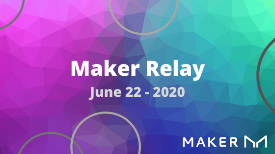

Hey, Maker community, welcome to the first edition of Maker Relay. This is your one-stop-shop for updates on the MakerDAO ecosystem written for a diverse band of stakeholders.

We value your input! Leave a reply, post in the forum, or join us in the Community-Development channel to let us know what you want to see. 

_**Disclaimer** (This update is assembled by a group of contributing members. By no means is this meant to serve as an inducement to take any investment position or make any financial decisions. This update is purely for informative and communications purposes only.)_

# Stakeholders

## Maker (MKR) Holders + DAI Holders + Vault Owners

## Major Governance Moves & Polls

Governance at a glance

[This Week’s Polls](https://vote.makerdao.com/polling) (22/06/2020)

Polls are using Instant Run-off so you can select multiple options and ranked-choices will be prioritized.

*   [Base Rate Adjustment](https://vote.makerdao.com/polling-proposal/qmvqc9njedfcfttk6sjpnun8qnyuc52uc6adt2hst4vtrz) \
Select a base rate for stability fees collected on Vaults between -4% and 4%. The current base rate is 0%.
*   [Dai Savings Rate Spread Adjustment](https://vote.makerdao.com/polling-proposal/qmzvkijnqgwg8an3pyhy376glsfbqfelxgqcpbnswqwx82) \
Select a Dai Savings Rate Spread between 0% and 4%. The current Dai Savings Rate is 0%.
*   [Should we add LINK to the Maker Protocol?](https://vote.makerdao.com/polling-proposal/qmaleb9ryc4xmhkjlm9ailxtxroft6khjejcd7otm6yf13) \
Ue
*   [Should we add WKT to the Maker Protocol?](https://vote.makerdao.com/polling-proposal/qmrzr4xwqxaiznubckiquwbyffffgkpdjrngczcwwfcdr7) \

*   [Should we add ENJ to the Maker Protocol?](https://vote.makerdao.com/polling-proposal/qmrt8b8jwrynwiucvbpqmofxpqiskwyryszvdcqaka8xrz) \

*   [Should we add PAXG to the Maker Protocol?](https://vote.makerdao.com/polling-proposal/qmu8ty14qpgpy86dtwycpasywxgl4m4kwz7fyatyg3bwwm) \

*   [Should we add MATIC to the Maker Protocol?](https://vote.makerdao.com/polling-proposal/qmpilr6zwthsc6lpf4jnpkknqwywqlpnuvoa3jakwkfyca) \

*   [Should we add LEND to the Maker Protocol?](https://vote.makerdao.com/polling-proposal/qmfhnsk3vaahvf3dwaujzwczevrne9usfbblogl52ubqrz) \
 \

## Collateral Statuses, MIPs Update, and Current Cycle Point image

[Weekly MIPs Update #5 (June 8 -19)](https://forum.makerdao.com/t/weekly-mips-update-5/2833)

*   [MIPS Forum](https://forum.makerdao.com/c/MIPs/14)
    *   [Ideas](https://forum.makerdao.com/c/MIPs/conception/20)
    *   [Proposals](https://forum.makerdao.com/c/MIPs/proposal-ideas/21)
    *   [Requests for Comments (RFCs)](https://forum.makerdao.com/c/MIPs/rfc/15)
    *   [Formal Submissions (FS)](https://forum.makerdao.com/c/MIPs/fs/16)
    *   Pre MIPs discussions

## State of the Peg

[https://daistats.com/#/](https://daistats.com/#/)
[http://dai.descipher.io/](http://dai.descipher.io/)

*   Dai remains slightly above peg at ~1.008. 
*   Eth price fluctuations generally keep an inverse correlation. If vault owners are unsure about Eth’s price they are even less sure about opening leveraged positions.
*   WBTC Debt Ceiling close to cap, waiting on a signalling post for any changes.
*   Longer term rising trend in ETH vaults but short term additions mirror Eth volatility. 

### Dai-ve deeper into the Forums

1. [Why aren’t MKR Holders voting?](https://forum.makerdao.com/t/why-arent-mkr-holders-voting/301) \

2. [Maker Vault Compensation Updates and Status](https://forum.makerdao.com/t/maker-vault-compensation-updates-and-status/2583)
3. [Black Thursday Vault Owners - Report Thread](https://forum.makerdao.com/t/black-thursday-vault-owners-report-thread/1566)
4. 

# Contributors

## Working groups updates 

Vault analysis team

## Meetings

*   Community Development Meetings
    *   Tuesdays at 16:00 UTC
        *   [Zoom](https://us02web.zoom.us/j/85424444710) - Message #community-development in [Maker Chat](https://chat.makerdao.com/) for password
        *   [Contributing](https://community-development.makerdao.com/contributing)
*   Community Collateral Onboarding
    *   Wednesdays at 17:50 UTC
        *   [Zoom]( https://zoom.us/j/697074715) - Message #community-development in [Maker Chat](https://chat.makerdao.com/) for password
*   Governance & Risk
    *   Thursdays at 16:00 UTC
        *   [Video/Voice](https://zoom.us/j/697074715)
        *   [Dial-in](https://zoom.us/u/acRbIMDvK)
        *   [Calendar](https://calendar.google.com/calendar/embed?src=makerdao.com_3efhm2ghipksegl009ktniomdk@group.calendar.google.com&ctz=America/Los_Angeles)
        *   [Archives](https://community-development.makerdao.com/governance/governance-and-risk-meetings)
        *   [Contributing](https://forum.makerdao.com/c/governance/gnr/8)

# Reference Links

____________________________________________

# Noobs

## Tweet of the week, Reddit post of the week 

    N00b

[https://twitter.com/stephendpalley/status/1119600502164135937](https://twitter.com/stephendpalley/status/1119600502164135937)

[https://twitter.com/RuneKek/status/1270807465202978818](https://twitter.com/RuneKek/status/1270807465202978818)

[Twitter](https://twitter.com/search?q=makerdao&src=typed_query)

<a href="https://www.reddit.com/r/MakerDAO/">Reddit</a>

## Looking to learn more about MakerDAO?

Check out these excellent resources:

*   [Introduction to the Maker Protocol](https://docs.makerdao.com/)
*   [Awesome-MakerDAO (AMD)](https://awesome.makerdao.com/') is a community-driven resource people can use to familiarize themselves with Dai and MakerDAO.

# Feedback

#### Feedback and room for improvement

Survey link

### **_Ideas_**

Philosophy Corner (a.k.a. The Dao of DAOs)

Meme alley. All things memes, salt and shit posts. Post your memes here.

Add ecosystem builder (Scale to interview someone building with Dai every other week)

Add ecosystem participant (anonymous from twitter)

Add “Meet a Maker” section, could be someone at Foundation but could also be ecosystem partner who wants some forum exposure.

“Knowledge Pill” each week: explain a part of the system, once a week.

I’d be aware of length when writing this newsletter, especially if it’s once a week. Want to hit a good balance of stuff that people will want to read, and useful links. 

#### Content Strategy

Goal: To aggregate and promote information and news relevant to MakerDAO PR to the DAO.

*   Primary - Post to Medium or Gitbook (or a decentralized alternative) so we can track analytics.
*   Syndication
    *   Reddit
        *   MakerDAO
        *   Ethereum
        *   ETHFinance
    *   Telegram
        *   MakerDAO Official
        *   DeFi
    *   Maker Forum
    *   Maker Chat
        *   Shillabees
        *   community-development
        *   governance-communications-ext
*   Analytics - To be shared:
    *   In GovComm & CommDev calls
    *   Maker Forum
    *   Maker Chat
    *   As part of Comms At A Glance?