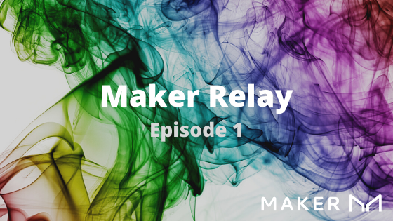

# Maker Relay 01

_Hey, everyone, thanks for checking out Maker Relay!_

Whether you hold Maker (MKR) or DAI, own a vault, or want to get more involved in MakerDAO governance, this is your one-stop-shop for updates on the MakerDAO ecosystem.

## Governance

### Polls

Some Polls use instant run-off so you can select multiple options and ranked-choices will be prioritized.

- [Base Rate](https://vote.makerdao.com/polling-proposal/qmtsig9y1zmfwb2eg62mbydqdjh12ftsdoyc9qc1kamkwu)
- [Adjust the WBTC Debt Ceiling and Risk Premium](https://vote.makerdao.com/polling-proposal/qmzbjhbvompj77ud2yw3f1zatxgitt72q7cukx3mqtath9)

#### Collateral

Collateral inclusion polls will run until Monday July 6, 2020 at 4PM UTC.

- [ENJ](https://vote.makerdao.com/polling-proposal/qmrt8b8jwrynwiucvbpqmofxpqiskwyryszvdcqaka8xrz)
- [KNC](https://vote.makerdao.com/polling-proposal/qmzp6crkyuwmwrx9whjk8gbw4cfpqkoz8jthaigmczjbak)
- [LEND](https://vote.makerdao.com/polling-proposal/qmfhnsk3vaahvf3dwaujzwczevrne9usfbblogl52ubqrz)
- [LINK](https://vote.makerdao.com/polling-proposal/qmaleb9ryc4xmhkjlm9ailxtxroft6khjejcd7otm6yf13)
- [MATIC](https://vote.makerdao.com/polling-proposal/qmpilr6zwthsc6lpf4jnpkknqwywqlpnuvoa3jakwkfyca)
- [PAXG](https://vote.makerdao.com/polling-proposal/qmu8ty14qpgpy86dtwycpasywxgl4m4kwz7fyatyg3bwwm)
- [WKT](https://vote.makerdao.com/polling-proposal/qmrzr4xwqxaiznubckiquwbyffffgkpdjrngczcwwfcdr7)

### MIPs Updates

There are no new MIP-related votes or polls this week, as the July Governance Cycle will launch the following week.

The June MIPs proposal [Executive vote](https://vote.makerdao.com/executive-proposal/june-2020-mips-official-ratification), ratifying a [bundle of proposals](https://vote.makerdao.com/polling-proposal/qmtxpw9xlsg1ozyymqxujdfdemn1vd7iacbrykqp9miakq), was passed. These proposals covered:

- Amendments
  - [MIP4c2-SP1: MIP6 Amendments](https://forum.makerdao.com/t/mip4c2-sp1-mip6-amendments/2663)
  - [MIP4c2-SP2: MIP8 Amendments](https://forum.makerdao.com/t/mip4c2-sp2-mip8-amendments/2664)
  - [MIP4c2-SP3: MIP9 Amendments](https://forum.makerdao.com/t/mip4c2-sp3-mip9-amendments/2665)
  - [MIP4c2-SP4: MIP12 Amendments](https://forum.makerdao.com/t/mip4c2-sp4-mip12-amendments/2666)
- [Onboarding a Risk Team](https://forum.makerdao.com/t/mip7c3-sp2-domain-team-onboarding-risk-domain-team/2702)
- [Declarations of Intent (MIP13)](https://forum.makerdao.com/t/mip13-declarations-of-intent/2461)

#### More about MIPs

- [Weekly MIPS Update #7 (June 22-26)](https://forum.makerdao.com/t/weekly-mips-update-7/2958)
- [MIPs Forum](https://forum.makerdao.com/c/MIPs/14)
  - [Ideas](https://forum.makerdao.com/c/MIPs/conception/20)
  - [Proposals](https://forum.makerdao.com/c/MIPs/proposal-ideas/21)
  - [Requests for Comments (RFCs)](https://forum.makerdao.com/c/MIPs/rfc/15)
  - [Formal Submissions (FS)](https://forum.makerdao.com/c/MIPs/fs/16)

### Governance Cycle

- The formal submission period for the July governance cycle ends **July 8th**. If you have any proposals in progress, post them in the forums to get review sooner rather than later.
- Clarity about formal submissions on [this post by Rich Brown](https://forum.makerdao.com/t/about-the-formal-submission-category/1981).

_Want to refresh your voting knowledge? Check out our [voter onboarding guide](https://community-development.makerdao.com/onboarding/voter-onboarding)!_

## Domain Teams

### Smart Contracts Team

#### Small bug in the Flopper Contract

- A small bug was discovered in the `flopper` contract.
- The Smart Contract Team have also realized that the three different auction contracts: the `flip`, `flop`, and `flap` (or collateral, debt, and surplus auctions) require double liquidity when interacting with them in certain cases.
- It has been already fixed, tested, and formally verified.
- The Smart Contracts Team plans on fixing those in the next governance cycle, deploying new versions of all of these contracts.

#### Impact

- This is a change that impacts everybody running a keeper or Maker protocol UI (E.g., DeFi Saver). The only impact is that the interface needs to point to a new smart contract. Nothing in the interface changes.
- This is not an emergency but an upgrade.

## Working groups

### Vault Compensation Analysis Team

The self-organized group led by Monet_Supply and MakerMan have released a [Vault Compensation Plan Proposal](https://forum.makerdao.com/t/vault-compensation-plan-proposal/2900) for Governance discussion.

- The extensive plan addresses possible ways of compensating victims of both zero-bid auctions, and sub-optimal self-liquidated vaults around the period of Black Thursday.
- It includes 5 phases (zero through four) and includes calculations, examples, and indicates what steps MKR holders need to agree upon to move this forward.
  

#### More information

- [Compensation Plan Document](https://docs.google.com/document/d/1dWFgAQF0bFPyadwOR1oqodIUTbMS2eGfP4DJwYgPM-c/)
- [MakerDAO Vault Compensation Plan Presentation](https://docs.google.com/presentation/d/1jFe6QrqOtZp4ylDlXRwDb00wfLmNt8jgGYY3hPoEPFw/)

## State of the Peg

- DAI price remains _just slightly_ above peg, trading at $1.002. It continues it's trend closing in on $1.

- DAI supply at \$128 million.

- Volume at around \$43 million this last week.

- Small price fluctuations haven't particularly affected price as much as sustained downward momentum on ETH. In those conditions, Dai starts to trade at a premium in anticipation of possible liquidations.

https://daistats.com/#/ | http://dai.descipher.io/

## From the Community

### Articles

- [June 28, 2020: KNC and ZRX Approved by Maker Governance as Collateral Types in the Maker Protocol](https://blog.makerdao.com/knc-and-zrx-approved-by-maker-governance-as-collateral-types-in-the-maker-protocol/)
- [June 26, 2020: Remaking the Maker Protocol by Ross Ulbricht](https://medium.com/@RossUlbricht/remaking-the-maker-protocol-4b29f879f11)

### Maker Forum Deep Dai-ve

[Discussion: Liquidity Mining Impacts](https://forum.makerdao.com/t/discussion-liquidity-mining-impacts/2898)
A discussion about the COMP token drop and liquidity mining in general.

[Wallet & CDP Liquidation-based Predictive Scoring Model](https://forum.makerdao.com/t/wallet-cdp-liquidation-based-predictive-scoring-model/2687)

[RFC: MIP14: Protocol DAI Transfer](https://forum.makerdao.com/t/mip14-protocol-dai-transfer/2462/36)
A generic process for transfering DAI from the Maker Protocol to a target Ethereum address.

[The Gnosis team discusses Batch vs. Dutch auctions](https://forum.makerdao.com/t/liquidations-batch-vs-dutch-auctions/2960)
Why Gnosis uses batch rather than dutch auctions for liquidation.

[A Liquidation System Redesign: A Pre-MIP Discussion](https://forum.makerdao.com/t/a-liquidation-system-redesign-a-pre-mip-discussion/2790/46)

[Adding a poll to prioritize collateral applications](https://forum.makerdao.com/t/adding-a-poll-to-prioritize-collateral-applications/2936)

## Meetings and Events

### MakerDAO Open Calls

#### Community Call

- Tuesdays at 16:00 UTC | [Crowdcast](https://www.crowdcast.io/e/the-makerdao-community/register)

#### Community Collateral Onboarding

- Wednesdays at 17:50 UTC | [Zoom](https://zoom.us/j/697074715) - Message #governance-and-risk in Maker Chat for password

#### Governance & Risk

- Thursdays at 16:00 UTC | [Zoom](https://zoom.us/j/697074715)
  - Message [#governance-and-risk](https://chat.makerdao.com/channel/governance-and-risk) for Admission
  - [Agenda](https://forum.makerdao.com/t/agenda-discussion-scientific-governance-and-risk-99-thursday-july-2-9am-pst-4-00-pm-utc/2944) | [Dial-in call link](https://zoom.us/u/acRbIMDvK) | [Calendar](https://calendar.google.com/calendar/embed?src=makerdao.com_3efhm2ghipksegl009ktniomdk@group.calendar.google.com&ctz=America/Los_Angeles)
  - [Archives](https://community-development.makerdao.com/governance/governance-and-risk-meetings)
  - [Contributing](https://forum.makerdao.com/c/governance/gnr/8)

## Have Feedback?

We value your input!

Post in the [forum](https://forum.makerdao.com/), take our [survey](https://forms.gle/Z2QAgywU2Sesm7Vy6), or join us in the [Community-Development](https://chat.makerdao.com/channel/community-development) channel to let us know what you want to see.

_Disclaimer: This update is assembled by a group of contributing members in the MakerDAO community. This does and should not serve as financial advice or an inducement to vote in any specific way. This update is purely for informative and for communications purposes only._
