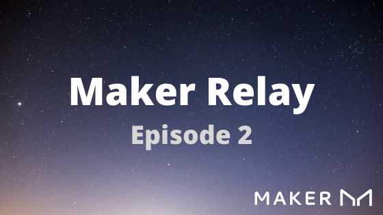

# Maker Relay 02

_Hey, everyone, thanks for checking out Maker Relay!_

Whether you hold Maker (MKR) or DAI, own a vault, or want to get more involved in MakerDAO governance, this is your one-stop-shop for updates on the MakerDAO ecosystem.

## Governance

### Executive

- An [executive proposal](https://vote.makerdao.com/executive-proposal/raise-the-etha-debt-ceiling-to-160m) has been added to increase the ETH-A debt ceiling from 140m to 160m.
- The [previous executive proposal](https://vote.makerdao.com/executive-proposal/add-oracles-lower-the-base-rate-raise-the-wbtc-and-usdc-debt-ceiling-and-risk-premiums) passed July 3. As a result, Maker:
  - [Increased the WBTC Debt Ceiling and Risk Premium](https://vote.makerdao.com/polling-proposal/qmzbjhbvompj77ud2yw3f1zatxgitt72q7cukx3mqtath9)
  - Lowered the [Base Rate to 0%](https://vote.makerdao.com/polling-proposal/qmtsig9y1zmfwb2eg62mbydqdjh12ftsdoyc9qc1kamkwu)
  - Whitelisted Oracles
    - DeFi Saver on ETHUSD, BATUSD, and WBTCUSD
    - MCDEX on ETH/USD
  - Appointed Light Feeds
    - Kyber Network
    - Infura
    - Etherscan
    - Gitcoin

### Polls

Polls use [instant run-off](<https://ballotpedia.org/Ranked-choice_voting_(RCV)>), so you can select multiple options and ranked-choices will be prioritized.

- _New_ [Base Rate poll is up](https://vote.makerdao.com/polling-proposal/qmrkaoiwdygtj1wpmmlxxz9gurqf4wweku8lhkwxv4nzlg), including options between -4% and 4%. This will set the base [stability fee](https://community-development.makerdao.com/makerdao-mcd-faqs/faqs/glossary#stability-fee) for all collateral types.
  Last week 0% was the winner, so [the rate is decreasing in this week's executive](https://vote.makerdao.com/polling-proposal/qmtsig9y1zmfwb2eg62mbydqdjh12ftsdoyc9qc1kamkwu).
- _New_ [DSR Spread poll is up](https://vote.makerdao.com/polling-proposal/qmclx2ybsqpfjb2yucqugq4ribrkndajbxjsheglfddcge). DSR Spread options are 0% to 4.25%
- [Polling was unanimous](https://vote.makerdao.com/polling-proposal/qmzbjhbvompj77ud2yw3f1zatxgitt72q7cukx3mqtath9) to raise the WBTC Debt Ceiling from 10m to 20m and the Risk Premium from 1% to 2%.

#### Collateral Inclusion

Most of the collateral inclusion polls concluded on Monday July 6, 2020 at 4PM UTC.

- [KNC](https://vote.makerdao.com/polling-proposal/qmzp6crkyuwmwrx9whjk8gbw4cfpqkoz8jthaigmczjbak) is a special case since it carried over from the last governance process. It runs until Monday July 13, 2020 at 4PM UTC.
- _Passing_: [LINK](https://vote.makerdao.com/polling-proposal/qmaleb9ryc4xmhkjlm9ailxtxroft6khjejcd7otm6yf13), [PAXG](https://vote.makerdao.com/polling-proposal/qmu8ty14qpgpy86dtwycpasywxgl4m4kwz7fyatyg3bwwm), [WKT](https://vote.makerdao.com/polling-proposal/qmrzr4xwqxaiznubckiquwbyffffgkpdjrngczcwwfcdr7)
- _Not Passing_: [ENJ](https://vote.makerdao.com/polling-proposal/qmrt8b8jwrynwiucvbpqmofxpqiskwyryszvdcqaka8xrz), [LEND](https://vote.makerdao.com/polling-proposal/qmfhnsk3vaahvf3dwaujzwczevrne9usfbblogl52ubqrz), [MATIC](https://vote.makerdao.com/polling-proposal/qmpilr6zwthsc6lpf4jnpkknqwywqlpnuvoa3jakwkfyca)

### MIPs Updates

The July Governance Cycle begins today. Two proposals are in the Request-For-Comments phase.

- [MIP16](https://forum.makerdao.com/t/mip16-the-weekly-governance-cycle/3008) defines and formalizes the Weekly Governance Cycle adding a predictable framework for Governance decisions.
- [MIP17](https://forum.makerdao.com/t/mip17-weekly-actual-debt-ceiling-adjustments-and-utilization-based-risk-premium-adjustments/3021) builds on MIP16 to define a process/solution for weekly Debt Ceiling and utilization based Risk Premium adjustments.

**Learn more about [Maker Improvement Proposals (MIPs)](https://forum.makerdao.com/c/MIPs/14) in the Maker Forum**

### Governance Cycle

- The [formal submission](https://forum.makerdao.com/c/MIPs/fs/16) period for the July governance cycle ends **July 8th**. If you have any proposals in progress, post them in the forums to get review sooner rather than later.
  - Formal submissions [clarifier](https://forum.makerdao.com/t/about-the-formal-submission-category/1981)

_Want to refresh your voting knowledge? Check out community development's [voter onboarding guide](https://community-development.makerdao.com/onboarding/voter-onboarding)!_

## Domain Teams

### Smart Contracts

#### Token Smart Contract Assessments

The two latest evaluations found that both LEND and MANA are low risk contracts. Read more here:

- [LEND](https://forum.makerdao.com/t/lend-erc20-token-smart-contract-domain-team-assessment/3094)
- [MANA](https://forum.makerdao.com/t/mana-erc20-token-smart-contract-domain-team-assessment/3095)

### Risk

#### COMP Summary and Risk Overview

- Cyrus shared a mental model for "negative stability fees." A practical translation to Maker Governance norms and vocabulary. From the [Governance and Risk meeting](https://youtu.be/Rn2MGdQ4L7A?t=953):
  - "imagine if some third party service was offering a very high DSR, then you could see a potential huge influx of demand for Dai. And at the same time the same third party is providing a source of very negative [stability fees,](https://community-development.makerdao.com/makerdao-mcd-faqs/faqs/glossary#stability-fee) which makes borrowing very attractive there..." "a large influx of demand to get this external DSR and refinancing (from Maker to Compound) requires sourcing Dai on the secondary market."
  - This creates nuanced complexities and incentives, it also implies some risk to the Maker protocol coupling higher demand for Dai with recycling leverage.
  - [Compound Governance Proposal 11](https://compound.finance/governance/proposals/11) passed, updating COMP per block allocation in each market. The formula is now: `totalBorrows * USD Value` and thus, follows natural borrowing demand. Discussions, updates, Pull Requests, and comments [can be found here](https://compound.comradery.io/post/1769).
  - Concentration in one market subsided, Maker Governance [discussed more options](https://forum.makerdao.com/t/signal-request-eth-a-stability-fee-and-debt-ceiling-adjustments/3059/6) to handle threats to the protocol, there were no emergency executive votes.

##### COMP links on the forum

- [Summary of issues and poll by Planet_X](https://forum.makerdao.com/t/poll-options-to-handle-comp-farming/2981)
- [Signal Request- USDC-A Stability Fee and Debt Ceiling adjustments](https://forum.makerdao.com/t/signal-request-usdc-a-stability-fee-and-debt-ceiling-adjustments/3020)
- [Upcoming COMP farming change could impact the Dai peg](https://forum.makerdao.com/t/upcoming-comp-farming-change-could-impact-the-dai-peg/2965/39)
- [Anticipatory poll about Debt ceiling and risk premium](https://forum.makerdao.com/t/signal-request-usdc-a-stability-fee-and-debt-ceiling-adjustments/3020)

##### Highlights from Makerchat

_Join the conversation in [#governance-and-risk](https://chat.makerdao.com/channel/governance-and-risk)_

@Maker_Man
"I think a distinction between dealing with COMP problem vs. dealing with general PEG stabilization mechanics is also a good distinction in discussion."

@brianmcmichael
"Seems to be a lot of demand for ETH vaults, but discussions are focused around stablecoins right now. A more aggressive debt ceiling raise for ETH-A should be on the table, IMO."

@rune
'what's important is that the PSM gives maker governance the option to truly fix the peg with stablecoins, should MKR holders decide they are willing to take on the risk. This means governance isn't forced to pick between abandoning the peg (Which could cause the system to death spiral) or work towards implementing negative rates, but that a third option will be on the table.'

@Maker_Man
"High PEG is good for DAI savers as when they need to buy something they get it at discounted prices. Good for borrowers when they do borrow because they get more \$$ value for their DAI loan. Bad for anyone looking to pay down debt (borrowers) as it is an extra fee. I can see why certain applications really want a constant PEG or one really tight to whatever they are PEG'd to. But even PM's the supposed 'safe haven' asset has price fluctuations. same with bonds though they can be held to maturity.. I think the real issue is that every stable coin has a redeemer that will give $1USD for the coin BUT Maker."

## Working groups

### Vault Compensation Analysis Team

The self-organized group led by Monet_Supply and MakerMan released a [Vault Compensation Plan Proposal](https://forum.makerdao.com/t/vault-compensation-plan-proposal/2900) for Governance discussion. In addition, they added [an informal forum poll to move forward with their plan](https://forum.makerdao.com/t/compensation-plan-forum-poll/3091).

#### More information

- They continue to post timley updates in [this thread on the forums](https://forum.makerdao.com/t/maker-vault-compensation-updates-and-status/2583/42)
- [Compensation Plan Document](https://docs.google.com/document/d/1dWFgAQF0bFPyadwOR1oqodIUTbMS2eGfP4DJwYgPM-c/)
- [MakerDAO Vault Compensation Plan Presentation](https://docs.google.com/presentation/d/1jFe6QrqOtZp4ylDlXRwDb00wfLmNt8jgGYY3hPoEPFw/)

## State of the Peg

- DAI has had continuing upward pressure towards and above 1.01. There is often an impact on price from secondary markets, since very often it’s a circular relationship. In addition, the demand for Dai to supply to Compound, and resupply as leverage, makes a liquidity crunch on Dai.

- DAI supply at \$179 million.

- Volume at around \$29 million this last week. Considerable trading volume in DyDx and Uniswap.
- Average VWAP price places Dai at \$1.013.

- ETH vaults collateralization ratio has moved to mostly 200%.

- Liquidation walls are at around $147 and $157 ETH<->USD.

https://daistats.com/#/ | http://dai.descipher.io/

## From the Community

### Articles

- [Maker Foundation Offers a 25,000 Dai Prize to Winner(s) of Reddit/Ethereum Scaling Competition
  ](https://blog.makerdao.com/maker-foundation-offers-a-25000-dai-prize-to-winner-of-reddit-ethereum-scaling-competition/)
- [Maker Governance Review: June 2020](https://blog.makerdao.com/maker-governance-review-june-2020/)
- [Making Maker: June 2020](https://blog.makerdao.com/making-maker-june-2020/)

### Maker Forum Deep Dai-ve

[MakerDAO Governance Audit Report](https://forum.makerdao.com/t/makerdao-governance-audit-report/2995)
Based on interviews with stakeholders, this report provides an assessment of the state of Maker governance and several proposals on how to reduce friction in governance processes.

[SourceCred Trial: Review of Month 1, Payout Increase](https://forum.makerdao.com/t/sourcecred-trial-review-of-month-1-payout-increase/2999)
One month in, SourceCred notes that "As the Maker governance community is relatively small, high trust and known for its civility, we did not expect overt gaming or drama. We were right :sweat_smile: We also suspected that $5,000/month worth of DAI may not be enough to financially incentivize many contributors. This also appears to be the case." and announces their decision "to increase the amount of DAI distributed each month from $5,000 to \$10,000."

[Peg Stabilization Modules: A Pre-MIP Discussion](https://forum.makerdao.com/t/peg-stabilization-modules-a-pre-mip-discussion/3045)
A thread for evaluating various proposals for maintaining the Dai peg in light of "recent pressure caused by COMP farmers using Dai as their asset of choice."

## Meetings and Events

### MakerDAO Open Calls

#### Community Call

- Tuesdays at 16:00 UTC | [Crowdcast](https://www.crowdcast.io/e/the-makerdao-community/register)

#### Community Collateral Onboarding

- Wednesdays at 17:50 UTC | [Zoom](https://zoom.us/j/697074715) - Message #governance-and-risk in Maker Chat for password

#### Governance & Risk

- Thursdays at 16:00 UTC | [Zoom](https://zoom.us/j/697074715)
  - Message [#governance-and-risk](https://chat.makerdao.com/channel/governance-and-risk) for Admission
  - [Agenda](https://forum.makerdao.com/t/agenda-discussion-scientific-governance-and-risk-99-thursday-july-2-9am-pst-4-00-pm-utc/2944) | [Dial-in call link](https://zoom.us/u/acRbIMDvK) | [Calendar](https://calendar.google.com/calendar/embed?src=makerdao.com_3efhm2ghipksegl009ktniomdk@group.calendar.google.com&ctz=America/Los_Angeles)
  - [Archives](https://community-development.makerdao.com/governance/governance-and-risk-meetings)
  - [Contributing](https://forum.makerdao.com/c/governance/gnr/8)

### Community Events

- July 14: [LenDit Fintech: How DeFi Will Reshape Global Finance (Virtual)](https://digital.lendit.com/talks/breaking-down-the-defi-buzz-how-defi-will-reshape-global-finance/)
- Sept. 15-16: [Copenhagen Fintech Week 2020 (Virtual)](https://cphfintechweek.com/)
- Sept. 22-24: [Money 20/20 Europe 2020—Amsterdam, Netherlands](https://europe.money2020.com/)
- Dec. 9-10: [Paris Blockchain Week Summit](https://www.pbwsummit.com/)

### Hackathons

- July 6-27 [Unitize - San Francisco Blockchain Week](https://gitcoin.co/hackathon/unitize/onboard)
- July 6 - Aug. 6 [HackFS](https://hackfs.com/)
- Oct. 2-20 [ETHOnline](https://www.ethonline.org/)

## Reference Links

Discuss and debate Maker governance in the [Forum]() and over [Maker Chat](https://chat.makerdao.com/)

Propose technical changes, poll, and vote in the [Governance Portal](https://makerdao.com/en/governance)

Learn more about the Maker protocol in our [Documentation](https://docs.makerdao.com/)

### Have Feedback?

We value your input! Post in the [forum](https://forum.makerdao.com/), take our [survey](https://forms.gle/Z2QAgywU2Sesm7Vy6), or join us in the [Community-Development](https://chat.makerdao.com/channel/community-development) channel to let us know what you want to see.

_Disclaimer: This update is assembled by a group of contributing members in the MakerDAO community. This does and should not serve as financial advice or an inducement to vote in any specific way. This update is purely for informative and for communications purposes only._
