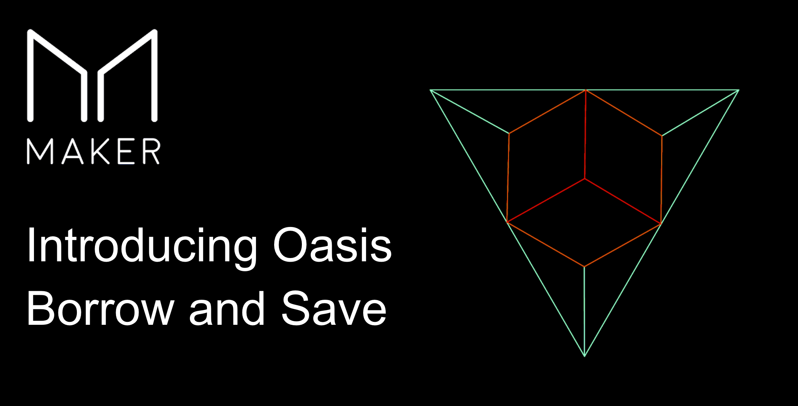
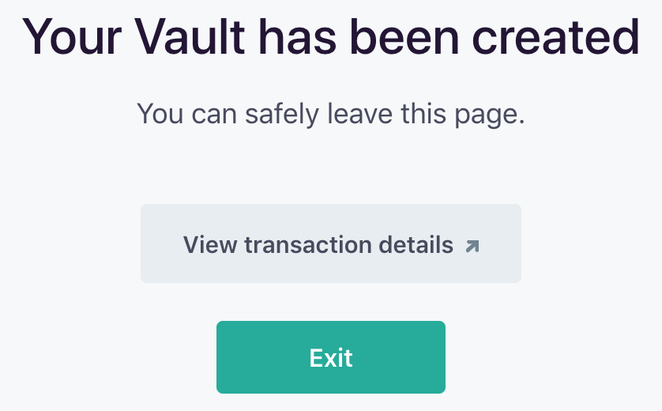
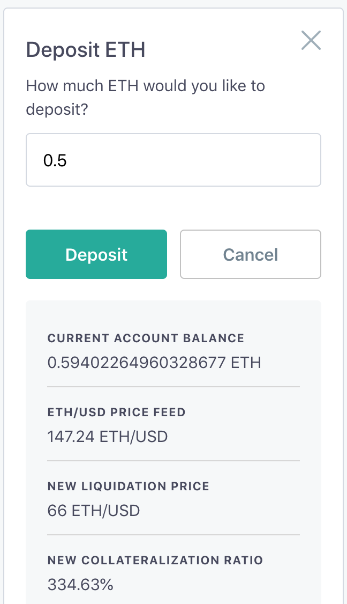

# Oasis Borrow Onboarding Guide

The Maker Protocol offers access to decentralized, non-custodial and permissionless leverage through Maker Vaults. Users can generate the Dai stablecoin by locking assets as collateral in a Vault. It’s important for individuals to be mindful of the risks associated with Vault usage, including those indicated in the applicable Terms of Service. This brief guide outlines the basics of getting started with Vaults on Oasis Borrow. While it presents the main features of Oasis Borrow, it only serves as an overall and general introduction.

## The Basics

### What is a Vault?

The Maker Vault is a core component of the Maker Protocol, which facilitates the generation of Dai against locked up collateral. All Dai in circulation are created by Vaults.

Vault usage collectively alters the total supply of Dai. Users create Dai by generating it against their collateral and in-turn destroy Dai when repaying their generated Dai balance. This process happens on-chain, which enables full auditability of circulating Dai and the collateral backing it.

Vaults are not free to use and come with inherent risks. Generating Dai requires the payment of [Stability Fees](../faqs/stability-fee.md) (SF). The SF is a variable rate and is subject to change based on the decisions of MKR Token holders through [voting](../faqs/governance.md). To reclaim collateral, users must repay the previously generated Dai and the accumulated SF.

Vaults are required to be overcollateralized and have a [Liquidation Ratio](../faqs/liquidation.md#what-is-the-liquidation-ratio) that Vault owners need to uphold to avoid the [Liquidation](../faqs/liquidation.md) of their Vaults. What a Vault is liquidated, a [Liquidation Penalty](../faqs/liquidation.md#what-is-the-liquidation-penalty) is applied, and collateral is sold to repay the Vault's outstanding Dai balance. Additionally, a [Debt Ceiling](#what-is-a-debt-ceiling) is imposed globally on the Maker Protocol, as well as individually on each Vault type.

For more information, visit the [Vault FAQ](../faqs/vault.md).

### Why Open a Vault?

Vaults let users access the underlying value of their assets while avoiding the need to sell them.

Some popular examples of how users are utilizing Vaults are listed below:

- **Leverage:** Speculators can “leverage” collateral in a decentralized manner to increase exposure to a given asset by investing the Dai generated from their Vault. Users seeking leverage should proceed with caution as it magnifies the risk of loss as well as the potential for gains.
- **Draw Liquidity from Your Assets:** Users looking for liquidity can turn to Vaults since Dai can serve any purpose. Some examples generate Dai off of their cryptocurrency assets to purchase automobiles, pay college tuition or cover home renovations.
- **Flexible Repayment Schedule:** Vaults offer flexible terms. There are no repayment schedules, no minimum payments, and no credit history requirements. Users can repay at their own pace as long as their Vault is properly collateralized. Read the section below on “Best Practices to Avoid Liquidation” for more in-depth information about how to maintain a healthy Vault.

Each of the above examples, as well as any use case of Vaults in general, is associated with various risks. Every user should have a good understanding of risks applicable in their situation, which depending on the risk profile intended may or may not make Vaults an appropriate solution for them.

## Walking Through Oasis Borrow

[Oasis Borrow](https://oasis.app/borrow) is the Maker Foundation’s front-end application for creating and interacting with Vaults. Users can open a Vault, generate and repay Dai, track collateral prices, send and receive tokens, and monitor global Dai and Vault statistics through this application.

As a web3 application, accessing Oasis requires a compatible wallet. For the most up to date list simply visit the Oasis site, the prompt to connect a wallet will provide you with all the current options. The most popular wallets like MetaMask, Trezor, and Ledger are compatible. When using your wallet, you are interacting with the Maker Protocol. Oasis Borrow provides a non-custodial infrastructure for your activities on the Maker Protocol layer.

On the [Oasis landing page](https://oasis.app/), click “Borrow Dai” to get started.

### Connecting a Wallet

Connect to a wallet from the listed options and accept the connection request. This example uses MetaMask, but other wallets operate similarly. Make sure the wallet contains some ETH to pay for transactions when creating or interacting with Vaults.

Connecting to Oasis is free. However, the connection process will need to be repeated for each new session once the wallet is disconnected.

### Oasis Borrow Dashboard

The Oasis Borrow Dashboard appears once a wallet is connected. Any existing Vaults associated with the wallet will appear here.

The top right-hand panel displays information about the connected wallet, including token balances. The menu below lists information about the global state of Vaults and [the prices of relevant assets.](../faqs/oracles.md)

### Opening a Vault

To open a new Vault, click “Get Started” on the dashboard.

Select a collateral type for this Vault. Make note of the information about the [Stability Fee](../faqs/stability-fee.md), [Liquidation Ratio](../faqs/liquidation.md#what-is-the-liquidation-ratio), and [Liquidation Penalty](../faqs/liquidation.md#what-is-the-liquidation-penalty). These are important risk parameters which you should understand as well as be able to apply to your specific situation. When ready, click “Continue.”

This page configures the Vault for easy management. This step only needs to be done once. Click “Setup” and confirm the transaction on the wallet. Using Metamask, each transaction screen will look similar to the screenshot below:

Grant the Maker Protocol permission to interact with collateral. Click “Set” and approve the transaction on the wallet. This process must be repeated for each new collateral type.

Click “Continue” once everything is ready.

Now that the Vault is set up, decide how much collateral to deposit to your Vault in the Maker Protocol and the amount of Dai to generate. Make a note of the Vault’s parameters. Click “Continue” when ready.

- **Note the Collateralization Ratio and the Liquidation Price:** The Liquidation price should be comfortably below the collateral’s current price, depending on individual risk tolerance. If the collateral’s market price falls below the Liquidation price, the Vault will be liquidated and subject to the Liquidation Fee. Collateral will be sold for Dai until the Dai balance and Liquidation Fee are repaid.
- **Note the Stability Fee:** The SF is a variable rate that is subject to weekly changes by Maker Governance. Users are encouraged to take advantage of trusted online tools to help stay up-to-date with the latest Stability Fee rates.

Make sure the Vault parameters are satisfactory. Read and agree to the Terms of Service and acknowledge understanding that the Stability Fee is not a fixed rate. When ready, click “Open Vault” and approve the transaction on the wallet.

Congratulations! The Vault is ready! Newly generated Dai will appear in the wallet.

Hit “Exit” to return to the main Oasis Dashboard. The dashboard will display an overview of the Vault’s current state. Log in to Oasis with the same wallet to view the same Vaults in the future.

### Managing a Vault

Active Vaults can be managed from the main dashboard. Each Vault type is managed separately and accessible through the left side-bar. Users are able to payback or generate Dai, withdraw or deposit collateral, or view the Vault history. Click "Manage" to bring up the Vault manager dashboard.

### Generating More Dai

To generate more Dai, click "Generate" on the dashboard and fill in the requested information. The maximum available to generate is displayed for reference. **PLEASE NOTE generating additional Dai without subsequently adding additional collateral will result in a lower Liquidation Price putting the Vault at higher risk for liquidation.**

Check the preview to make sure the Vault's new terms are acceptable. Click "Generate" and follow prompts to confirm the transaction. Once approved, the Vault's dashboard will update to reflect the changes.

### Adding Collateral

Adding Collateral is useful in two scenarios. The first is when a Vault is coming close to being [liquidated](../faqs/liquidation.md), adding collateral can save the Vault. The second is when a Vault owner wants to increase their capacity for generating Dai, adding collateral will increase the maximum amount of Dai that can be generated.

To add collateral, click “Deposit” from the dashboard and fill in the desired amount.

Check the preview to make sure the Vault's new terms are acceptable. Click “Deposit” and follow prompts to confirm the transaction. Once approved, the Vault’s dashboard will update to reflect the changes.

### Paying Back Dai

Paying back Dai is useful in a number of situations. Similarly to adding collateral, paying back Dai is a [more efficient](../faqs/liquidation.md#how-do-i-lower-my-liquidation-price) way to save a Vault from liquidation. Additionally, paying back Dai is especially appropriate when a Vault owner thinks the Stability Fee is too high and wants to decrease the size of their position, the Vault is no longer needed, or when collateral needs to be freed.

To pay back Dai, click “Pay back” from the dashboard to bring up the menu below. Please note that when paying back Dai for the first time, a one-time transaction to unlock it needs to occur. Clicking the “Unlock DAI to Continue” switch above the "Pay back" button will bring up this transaction.

Check the preview to make sure the Vault's new terms are acceptable. Click “Pay Back” and follow prompts to confirm the transaction. Once approved, the Vault’s dashboard will update automatically to reflect the changes.

### Withdrawing Collateral

To withdraw collateral from a Vault and return it to the wallet, click “Withdraw” on the dashboard and enter an amount to withdraw. The maximum available to withdraw is displayed for reference. **PLEASE NOTE withdrawing collateral without first paying back Dai will result in a lower Liquidation Price putting the Vault at higher risk for liquidation.**

Check the preview to make sure the Vault's new terms are acceptable. Click “Withdraw” and follow prompts to confirm the transaction. Once approved, the Vault dashboard will update to reflect the changes. Withdrawn collateral will appear in the wallet, unlocked, and ready for use.

### Viewing Vault History

Find the Vault’s complete history listed below the dashboard. Scroll through to see a chronological record of its activity. Studying the Vault history can be a useful reference when reflecting on forgotten decisions and actions. One could also access other [3rd party websites and tools](https://awesome.makerdao.com/#monitor-vaults) for tracking this information.

## General Information on Vaults

The sections below present some best practices, useful tips, and resources related to Maker Vaults.

### Community Observed Means to Avoid Liquidation

**Maintaining a Vault's health is the Vault owner's responsibility.** Given the volatile nature of cryptocurrencies, a safe Vault can become at risk very quickly depending on the Dai balance and amount of Collateral locked within. Ensuring that the collateralized assets remain safe from liquidation is entirely in the hands of each Vault owner. Some commonly observed practices to avoid liquidation can be found below:

- **Monitor the Vault:**
  - Keep note of the Vault ID numbers that you are responsible for. This will enable you to identify your Vault without needing access to the wallet that owns it.
  - Maintain adequate access to the Vaults, especially during volatile periods in the markets.
  - Use [available tools and services](https://awesome.makerdao.com/#watch-your-dai) to keep an eye on a Vault’s status.
  - Set up price alerts for the collateral asset(s) being used, so that you know when the Liquidation Price is being approached.
- **Maintain Sideline Assets:**
  - Maintain access to readily available emergency funds or assets to pay back Dai or add collateral.
- **Unwind the Vault:**
  - Unwinding is when some collateral is withdrawn from the Vault and sold for Dai, the Dai is then used to pay down the Vault's generated Dai balance. Repeat the process until the Liquidation Price is a comfortable number.
  - When done manually, this technique temporarily puts the Vault in a riskier position until Dai is paid on the balance. This is because collateral is being withdrawn, which increases the Liquidation Price.
  - Set a personal rule to unwinding the Vault if the collateral price falls below a certain level or takes a sharp downturn. This may act as an additional buffer.
  - Some services will offer Vault unwinding for a nominal fee.
- **Use a Vault Unwinding service:**
  - There are 3rd party web3 applications that enable a Vault owner to automate the unwinding process. One example is [DefiSaver.com’s](https://defisaver.com/) Automate feature.
  - Note that the Vault owner is responsible for doing their due diligence to assess whether such a service is safe to use and legitimate.

Refer to the [Oasis Terms of Service](https://oasis.app/terms) for relevant legal information. Opening a Vault and generating Dai is an implicit agreement to the risks involved, you are solely responsible for your use of the Services, including all transfers of Digital Assets you make.

## Additional Resources

Refer to the links below for more information about Vaults and getting started with Oasis Borrow:

- [Awesome MakerDAO Resource Repository](https://awesome.makerdao.com/)
- [Dai FAQ](../faqs/dai.md)
- [Emergency Shutdown FAQ](../faqs/emergency-shutdown.md)
- [Liquidation FAQ](../faqs/liquidation.md)
- [Stability Fees FAQ](../faqs/stability-fee.md)
- [Vaults FAQ](../faqs/vault.md)

_This content is provided for informational purposes only, and should not be relied upon as legal, business, investment, or tax advice. You should consult your own advisers as to those matters.
Charts and images provided within are for informational purposes solely and should not be relied upon when making any financial decisions. Any projections, estimates, forecasts, targets, prospects, and/or opinions expressed in these materials are subject to change without notice and may differ or be contrary to opinions expressed by others._
