# MakerDAO Voter Onboarding

Ready to participate in MakerDAO Governance? An active community of voters is critical to the health and security of the MakerDAO ecosystem. This guide outlines the conceptual and practical basics of getting started with voting in MakerDAO.

## Why should MKR holders vote?

MakerDAO relies on its governance community to manage the Maker Protocol.

Successful governance helps grow the system and improves its long-term reliability, encouraging the widespread adoption of Dai. Malicious or negligent governance negatively impacts Dai and MakerDAO, which could cause financial loss to MakerDAO’s governors as MKR loses value.

Voting takes place frequently and requires a governance community who is actively considering what is best for the system. Winning votes can alter the governance processes and execute changes to the Maker Protocol, ideally ensuring Dai's stability while strengthening the system and its governance as a whole.

For more information, visit:

- [Governance FAQ](./faqs/governance.md)
- [Governance: Awesome-MakerDAO](https://github.com/makerdao/awesome-makerdao/blob/master/README.md#governance)
- [What is DAI Governance? - DAI Beginner Series](https://youtu.be/QHmNf_YROQU)

## Information and Participation

To foster a healthy voting community, MakerDAO encourages its community members to stay up-to-date with current governance matters and to participate in public discussions. This process helps MKR token holders make well-informed voting decisions.

The primary source of information for MKR token holders is the [Governance Forum](https://forum.makerdao.com/), a venue dedicated to hosting discussions on governance matters. Diving into the forum may be daunting for new voters. To remedy this, the community has created a recurring thread called “Governance at a Glance,” which summarizes the world of Governance by providing a weekly three-point summary and links to active threads under categories like Active Discussions, Seeking Consensus, Ongoing Initiatives, On the Horizon, and Help Wanted.

Matters are brought into the Governance Portal following community consensus as signaled on the forum. Members are encouraged to review the latest topics and provide input when possible. For more detailed information on the signaling process, please visit these two threads:

- [Current Signaling Process](https://forum.makerdao.com/t/current-signaling-process/396)
- [Signaling Guidelines](https://forum.makerdao.com/t/signaling-guidelines/223)

Weekly public Governance and Risk calls offer another valuable source of information for voters. These calls are organized and hosted by MakerDAO’s Interim Governance Facilitator and explore a broad range of themes ranging from establishing core principles to discussing the latest publications from Risk Teams, governance proposals, analysis of Dai, etc.

Community members and other stakeholders are encouraged to explore the archived [summaries](https://community-development.makerdao.com/governance/governance-and-risk-meetings/summaries), [transcripts](https://community-development.makerdao.com/governance/governance-and-risk-meetings/transcripts), [video recordings](https://www.youtube.com/playlist?list=PLLzkWCj8ywWNq5-90-Id6VPSsrk4OWVan), and [audio recordings](https://soundcloud.com/makerdao/sets/governance-and-risk) of previous meetings. The Governance and Risk meeting is a place for discussion and overview of current matters and does not function as a committee that makes decisions. Information about the schedule for Governance and Risk calls can be found [on this public calendar URL](https://calendar.google.com/calendar/embed?src=makerdao.com_3efhm2ghipksegl009ktniomdk%40group.calendar.google.com&ctz=America%2FNew_York), which also includes scheduled proposals and votes.

## Resources

A collection of sources and materials useful for MKR voters:

### Essential:

- [Governance Forum](https://forum.makerdao.com/c/governance)
- [Governance and Risk Meeting: Audio](https://soundcloud.com/makerdao/sets/governance-calls) | [Video](https://www.youtube.com/playlist?list=PLLzkWCj8ywWNq5-90-Id6VPSsrk4OWVan) | [Transcripts](https://github.com/makerdao/community/blob/master/governance/governance-and-risk-meetings/transcripts) | [Summaries](https://community-development.makerdao.com/governance/governance-and-risk-meetings/summaries)
- [Ratified Foundation Proposal](https://medium.com/makerdao/foundation-proposal-v2-f10d8ee5fe8c)
- [Voting Tutorial Video](https://youtu.be/wP7DedWcEmg?list=PLLzkWCj8ywWP6yCPPm1IRKysNsrzg3LQ6)

### Additional:

- [Awesome-MakerDAO: Governance](https://github.com/makerdao/awesome-makerdao#governance)
- [Awesome-MakerDAO: Voting](https://github.com/makerdao/awesome-makerdao#voting)
- [Governance FAQ](./faqs/governance.md)

## Governance Polling vs. Executive Voting

There are two ways MKR holders directly manage the system: Governance Polling and Executive Voting. Governance Polls establish a soft consensus and measure community sentiment, through [time-based voting](../faqs/governance#how-long-is-the-voting-period-of-a-governance-poll), while Executive Votes enact hard changes to the Protocol when passed, through [continuous approval voting](../faqs/governance#what-is-continuous-approval-voting).

Governance Polls cover topics like rate adjustments, priorities for including new assets into the system, governance process changes, and mandates for new roles. Polls often run concurrently, allowing voters to participate in any number of them at the same time. Successful Governance Polls advance to the next stage of the governance process to undergo an Executive Vote. While poll results do not enact hard changes to the Maker Protocol, they play a vital role in how governance moves forward. Poll outcomes provide insight into voters’ preferences.

Unlike the Governance Poll, an Executive Vote “executes” hard changes to the Maker Protocol. Typically, voters will choose between the winning poll and no change. These votes enact hard changes to the system itself, so community participation is strongly encouraged.

## The Governance Portal

The [Governance Portal](https://vote.makerdao.com/) is MakerDAO’s voting application, which stakeholders use to vote and manage their voting contracts. The Executive tab hosts the most recently enacted proposal as well as active Executive Proposals. Similarly, the Polling tab lists current and previous Governance Polls. The Voting Contract tab lets users set up and manage their voting contracts.

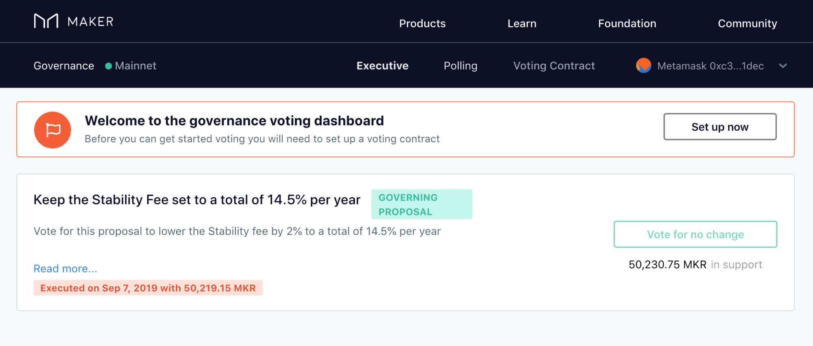
_The Governance Portal_

## The Voting Contract

The Voting Contract is the on-chain voting mechanism built directly into the Maker Protocol. To vote, MKR owners must "lock-up" tokens by transferring them into the Voting Contract. Votes are weighted based on the quantity of MKR locked in the contract. "Locked" MKR can be withdrawn at any time.

MKR token holders have the option to set up their Voting Contract with a single hot or cold wallet, or, as a linked wallet, for more secure voting. The linked wallet setup allows users to vote using a hot wallet, with MKR stored on a cold wallet.

Setting up a Voting Contract is a one-time action as long as the same wallet or wallets are used in future voting. However, to use another hot or cold wallet, the contract must be broken and set up again.

## The Vote Proxy

The Voting Proxy Contract makes linked wallet voting possible. Best practice suggests storing tokens of any significant value offline as much as possible, typically on a cold wallet. With linked wallet voting, MKR holders can use their hot wallet to vote with MKR safely stored on their cold wallet.

The hot wallet has permission to manage the voting contract, but it does not have the authority to transfer tokens. If the hot wallet is compromised, the link can be broken from the cold wallet. MKR stored on the cold wallet is always safe and unaffected by a compromised hot wallet.

Users looking to avoid the Vote Proxy can vote from a single wallet by depositing directly into the voting contract. While single wallet voting is less secure, the initial setup is more convenient, especially if the value of the wallet’s assets is trivial, or hardware wallets are not available. Users who store MKR on MetaMask or other web wallets may find it to be the easiest way to start voting.

Find more information in the Maker Foundation’s blog post on [the MakerDAO Voting Proxy Contract](https://blog.makerdao.com/the-makerdao-voting-proxy-contract/).

## Contract Setup and Voting Costs

Transactions on Ethereum's network require paying gas, with prices varying based on network traffic. Setting up a linked-wallet Voting Contract takes four transactions for a total of approximately 1M gas. This cost is split between the hot and cold wallets, so ensure at least some ETH is in each wallet. Expect to spend about a dollar or two worth of Ethereum to set up a Voting Contract. Voting itself is a single transaction and usually costs a few cents per vote, but varies depending on network congestion.

Visit the [ETH Gas Station](https://ethgasstation.info/) for help estimating the Gas price.

## Voting Wallet Setups

- **Linked Wallet Setup**: See the section below. _(Recommended)_
- **Single Wallet Setup**: [Skip ahead.](#single-wallet-setup)

### Linked Wallet Setup

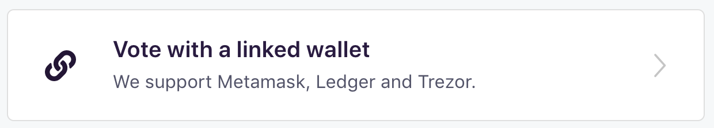
_Vote with a Linked Wallet_

The Linked Wallet Voting Contract can be set up using cold wallets like Trezor or Ledger, Paper Wallets using SETH or two MetaMask Accounts.

For illustration, this guide uses Trezor as the cold wallet and MetaMask as the hot wallet. The process is similar for other cold wallets. See the links at the end of this section for walkthroughs using different wallet types.

#### Trezor + MetaMask

Please have the Trezor wallet ready and the MetaMask browser extension installed and running. Log in and make sure the appropriate MetaMask account is selected.

Navigate to the [Governance Portal](https://vote.makerdao.com/). Before setting up the contract, connect Trezor and MetaMask.

**Connect MetaMask:** Find the [“Accounts”](https://vote.makerdao.com/) drop-down menu on the right side of the top banner. If MetaMask is active, the current account will show as an available wallet. Make sure this is the correct account and select it to use as the hot wallet.

_Select MetaMask Account_

**Connect Trezor:** In the [“Accounts”](https://vote.makerdao.com/) drop-down menu, select “Connect to Trezor.” The Trezor wallet must be plugged in for it to show up. Follow the steps to enter the Trezor’s pin and passcode. When prompted, select an address with MKR to use as the cold wallet. Click “Unlock Wallet.”

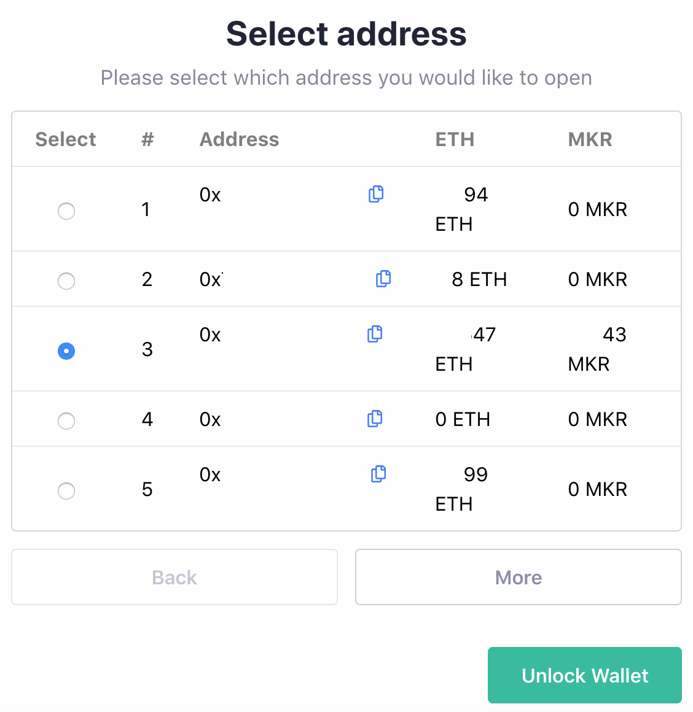
_Export Accounts and Select Address_

The “Accounts” drop-down menu will now show that both MetaMask and Trezor are connected.

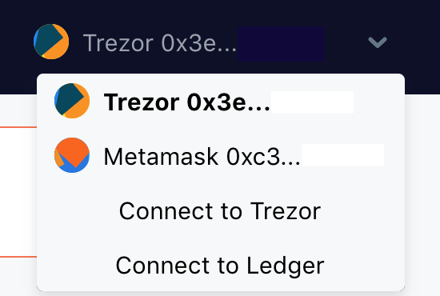
_Accounts_

Return to the front-page and select “Set Up Now” to start the contract setup.

_Set Up Now_

Select “Vote with a Linked Wallet” from the menu. Read and agree to the “Terms of Use” on the following page.

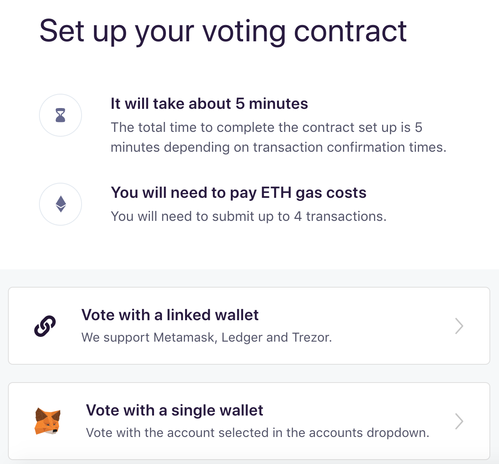
_Select a Voting Contract Type_
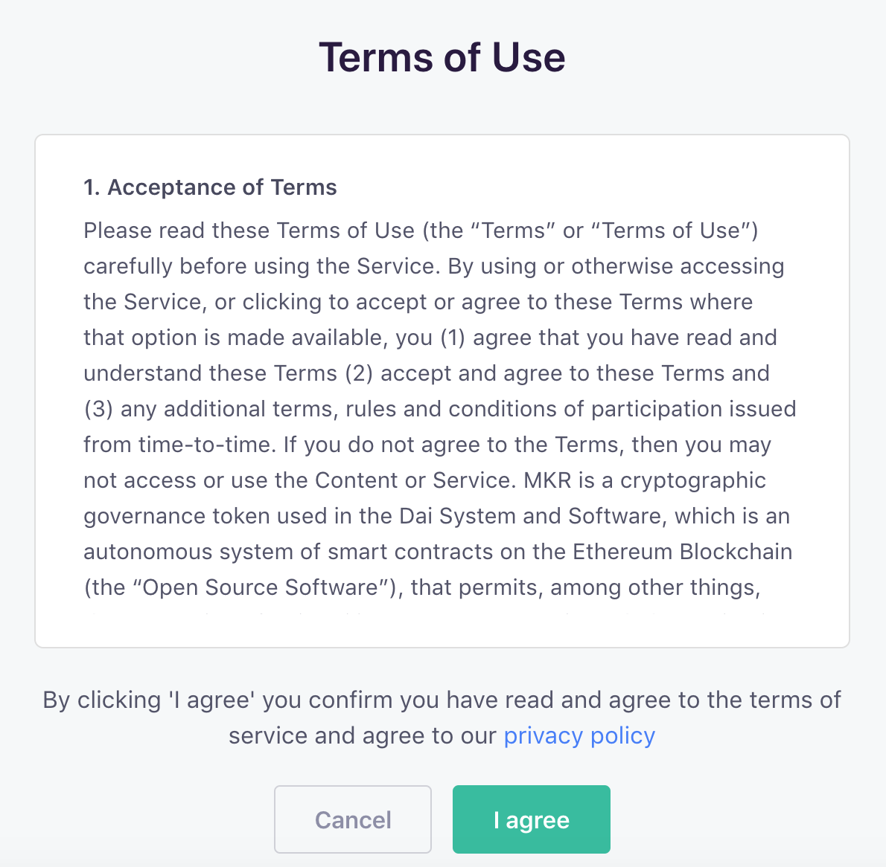
_Terms of Use_

On the following page, select MetaMask as the voting wallet. Click “Connect” to continue and “Confirm Voting Wallet” on the next page.

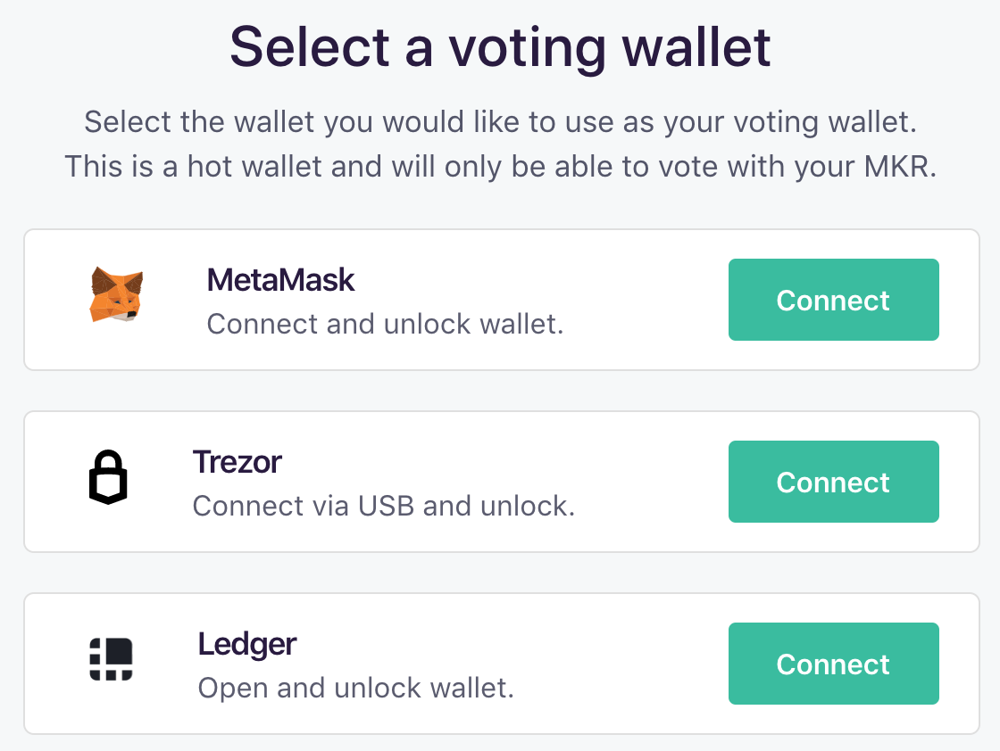
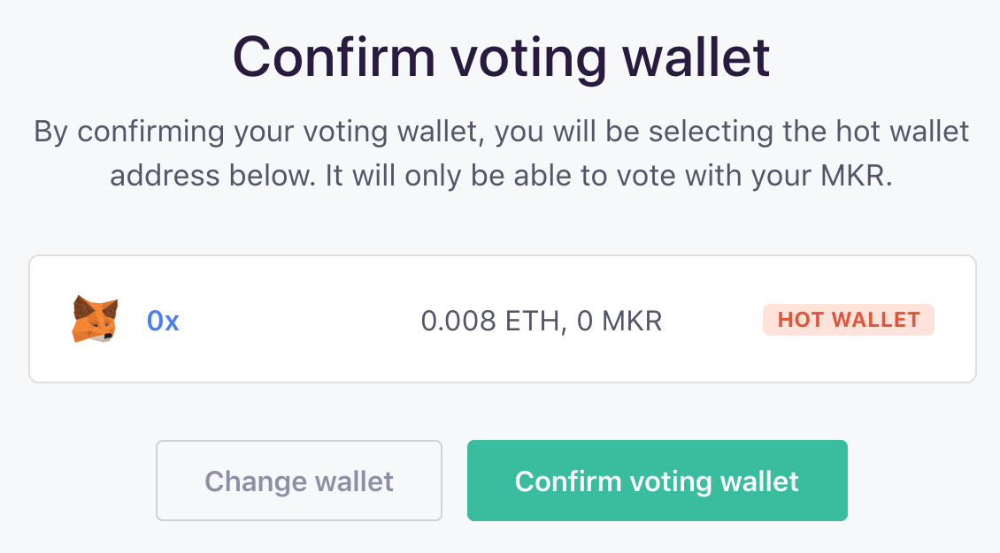
_Select a Voting Wallet_

Next, select a cold wallet, in this case, Trezor. Follow the steps to enter the Trezor’s pin and passcode. When prompted, choose an address with MKR. Click “Confirm Wallet.”

_Note: The above step might be skipped if a cold wallet was already selected in the wallet drop-down menu._

_Select Cold Wallet: Trezor_

Now that the hot and cold wallets are selected, the following step initiates the link to enable hot wallet voting with MKR stored on the cold wallet. Click “Link Wallets.”

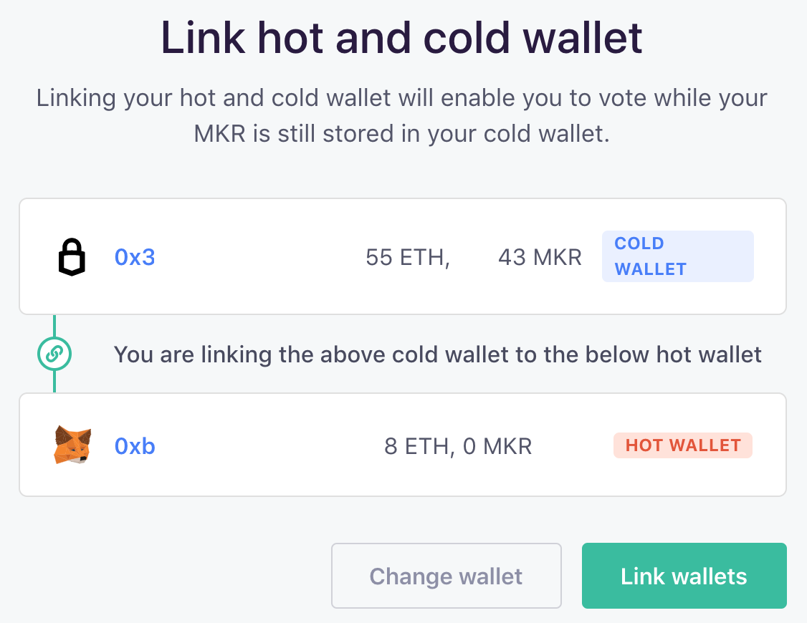
_Link Hot and Cold Wallet_

Sign transactions on Trezor and MetaMask to confirm the link. Click “Next” each time to continue and follow prompts to approve the transaction.

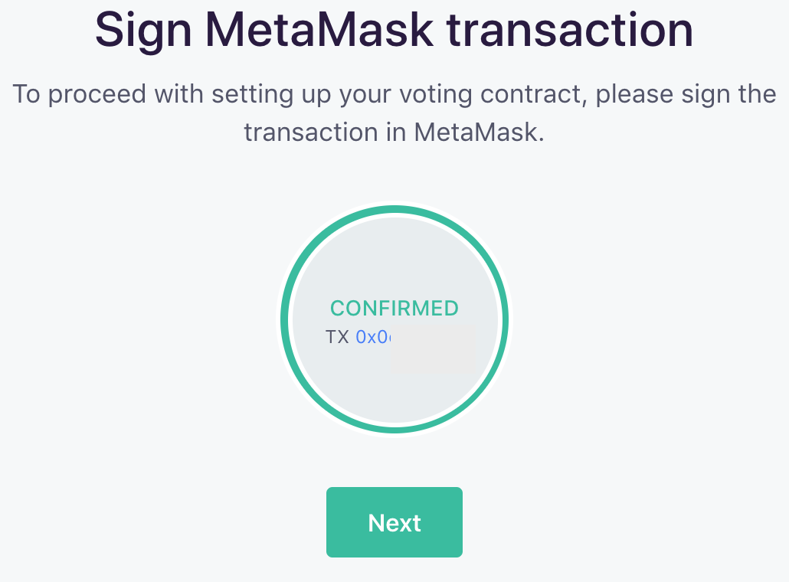
_Sign Trezor and MetaMask Transactions to Link Wallets_

To continue, grant the hot wallet permission to vote with the MKR stored on the cold wallet. Click “Next” and approve the transaction on Trezor.

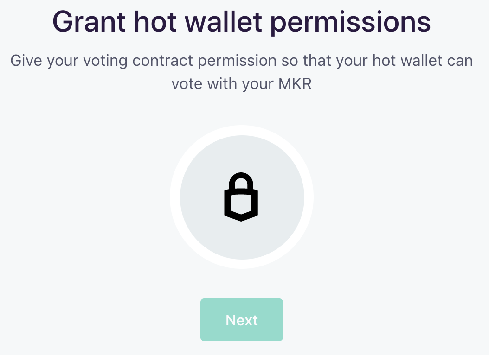
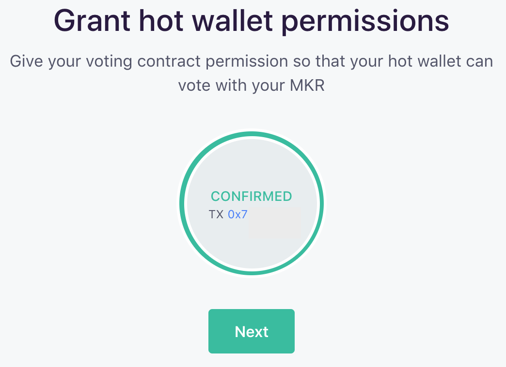
_Grant Hot Wallet Permissions_

Now, grant the contract transfer allowances for MKR tokens. Click “Next” and confirm the transaction on Trezor.

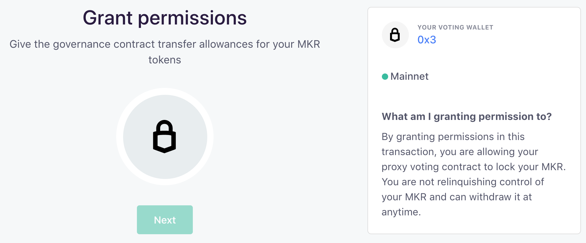
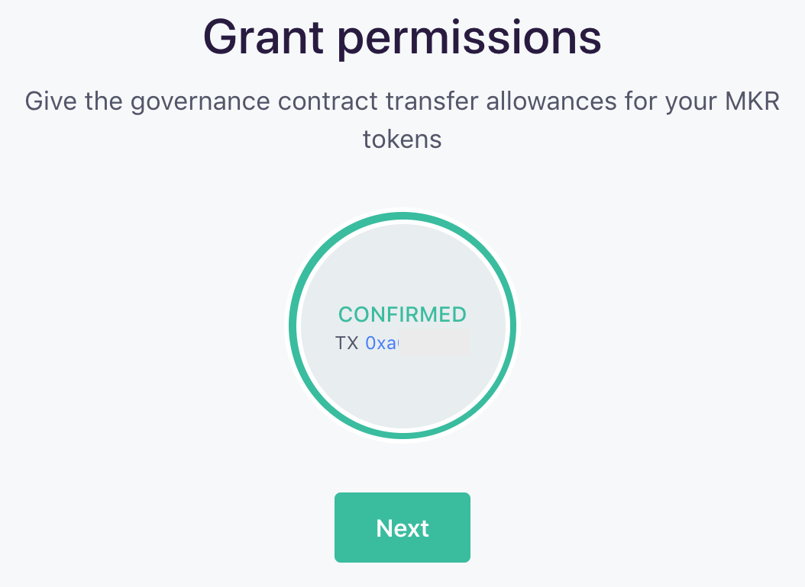
_Grant Transfer Permissions: Trezor_

Once the transaction is confirmed, grant the contract transfer allowances for IOU tokens. Click “Next” and confirm the transaction on Trezor.

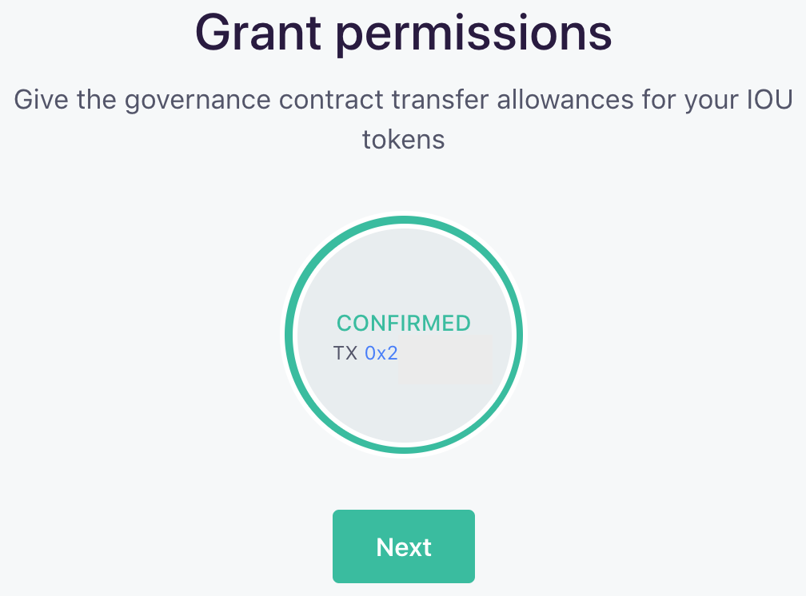
_Grant IOU Permissions: Trezor_

The final step is to “Lock MKR” into the voting system. Users may adjust the amount of MKR in their Voting Contract later by topping-up or withdrawing at any time with a single transaction.

_Note: See the end of this section for instructions on how to top-up or withdraw from the voting contract._

Set how much MKR to lock in the contract and click “Confirm.” Always check to make sure the information is correct. Click “Confirm” again and approve the transaction on Trezor.

_Lock MKR_

Once the transaction is confirmed, the Voting Contract setup is complete.

_Set Up Complete!_

Click “Start voting” to return to the main Governance Portal and to participate in Governance Polls and Executive Votes.

To begin voting, skip ahead to the [Voting Process](#the-voting-process) section.

#### Other Linked Wallet Setups

See the links below for in-depth, step-by-step walkthroughs for other wallet types:

- [Linked Wallet Setup: Trezor](https://web.archive.org/web/20190112110249/https://medium.com/makerdao/how-to-setup-the-voting-contract-using-a-trezor-hardware-wallet-af4969aa157f)
- [Linked Wallet Setup: Ledger Nano S](https://web.archive.org/web/20190112110248/https://medium.com/makerdao/how-to-setup-the-voting-contract-using-a-ledger-hardware-wallet-1f00d49ce43a)
- [Linked Wallet Setup: Two MetaMask Accounts](https://web.archive.org/web/20190112110247/https://medium.com/makerdao/how-to-setup-the-voting-contract-using-two-metamask-accounts-4e83e4fec602)
- [Linked Wallet Setup: Paper Wallets Using SETH](https://web.archive.org/web/20180913234419/https://medium.com/makerdao/guide-vote-proxy-setup-with-seth-f62397a10c59)

### Managing the Linked Wallet Voting Contract

#### Top-Up Voting Contract

For security reasons, locking additional MKR into the Voting Contract can only be done from the cold wallet, in this case, Trezor. To top-up the Voting Contract, make sure the cold wallet is plugged in. On the [Governance Portal](https://vote.makerdao.com/), select “Connect to Trezor” from the [“Accounts”](https://vote.makerdao.com/) drop-down menu.

_Connect to Trezor_

Follow the steps to enter the Trezor’s pin and passcode. When prompted, select the address that is linked to the Voting Contract. Click “Unlock Wallet.”

_Select Linked Cold Wallet Address_

Return to the [Governance Portal](https://vote.makerdao.com/) and click “Voting Contract” to bring up the secure voting menu. Select “Top-Up Voting Contract.”

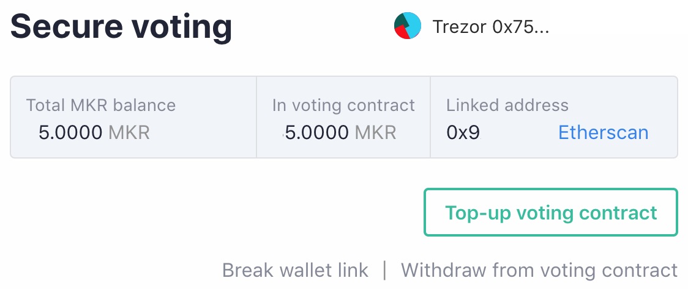
_Manage Voting Contract_

Enter the MKR amount to add to the contract and click “Lock MKR.” Approve the transaction on Trezor.

_Lock MKR_

Once the transaction is confirmed, the contract manager will reappear. The MKR balance in the voting contract will update to reflect the changes.

_Updated Voting Contract_

#### Withdraw MKR from Voting Contract

Use either wallet to withdraw MKR from the Voting Contract and return the tokens to the cold wallet. For this example, the MetaMask hot wallet will withdraw the locked MKR. The process is similar when using a cold wallet.

Make sure MetaMask is running, and the account associated with the contract is selected. On the [Governance Portal](https://vote.makerdao.com/), click “Voting Contract” to bring up the secure voting menu. Select “Withdraw from Voting Contract.”

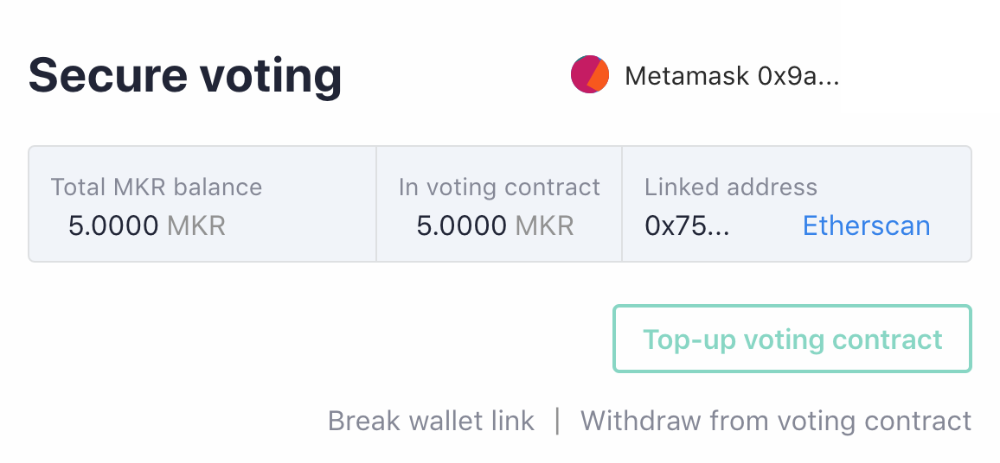
_Manage Voting Contract_

Enter the MKR amount to withdraw from the contract and click “Withdraw MKR.” Approve the transaction on MetaMask.

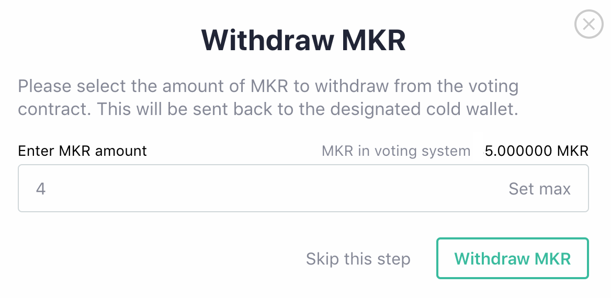
_Withdraw MKR_

Once the transaction is confirmed, unlocked MKR returns to the cold wallet, and the contract manager reappears. The MKR balance in the voting contract will update to reflect the changes.

_Updated Voting Contract_

#### Break Wallet Link

The wallet link can be broken from either the cold or the hot wallet, in turn, closing the contract. In case the hot wallet is compromised, the cold wallet can safely withdraw MKR from the contract before breaking the link.

_Note: All MKR must be withdrawn before the link can be broken. Follow the instructions above to withdraw all MKR from the contract._

For this example, the cold wallet will break the wallet link. On the [Governance Portal](https://vote.makerdao.com/), click “Connect to Trezor” from the [“Accounts”](https://vote.makerdao.com/) drop-down menu and connect to the Voting Contract’s cold wallet address.

_Connect to Trezor_

Return to the [Governance Portal](https://vote.makerdao.com/) and click “Voting Contract” to bring up the secure voting menu. Select “Break Wallet Link.”

_Manage Voting Contract_

If not done already, follow the prompt to withdraw any remaining locked MKR.

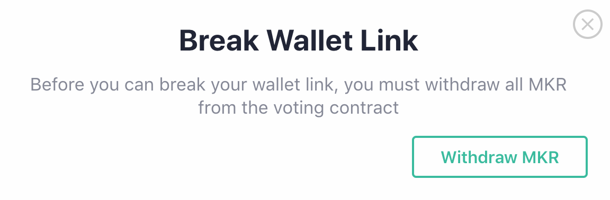
_Withdraw Remaining MKR_

Otherwise, click “Break Link” to close the contract. Confirm the transaction on the cold wallet.

_Break Wallet Link_

Once the transaction is confirmed, the link is broken, and the voting contract is closed. To vote again, return to the [Governance Portal](https://vote.makerdao.com/) to set up a new voting contract.

### Single Wallet Setup

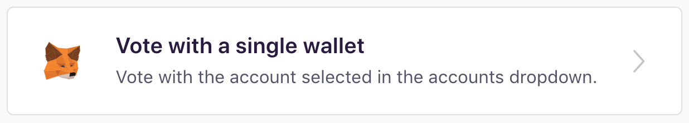
_Vote with a Single Wallet_

#### Metamask

To set up a Single Wallet Voting Contract, make sure the MetaMask browser extension is installed and running.

Navigate to the [Governance Portal](https://vote.makerdao.com/). Find the [“Accounts”](https://vote.makerdao.com/) drop-down menu on the right side of the top banner. Select the appropriate account to use as the contract wallet.

_Select Account_

Select “Set Up Now” on the highlighted section of the front-page to start the Voting Contract setup.

_Set Up Now_

Select “Vote with a Single Wallet” from the menu. Read and agree to the “Terms of Use” on the following page.

_Select a Voting Contract Type_

_STerms of Use_

The next page will ask to “Grant Permissions.” This grants the contract the ability to move MKR tokens. Confirm the transaction on MetaMask.

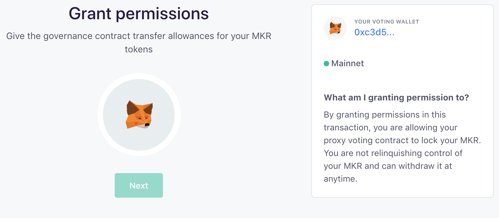
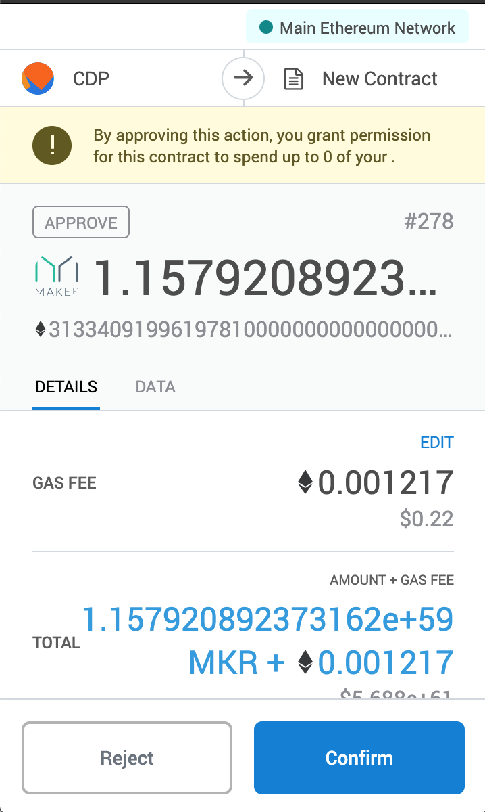
_Grant Permissions for MKR Token Transfer_

Click “Next” once the transaction is confirmed. The next page will grant the contract transfer allowances for IOU tokens. Confirm the transaction on MetaMask.

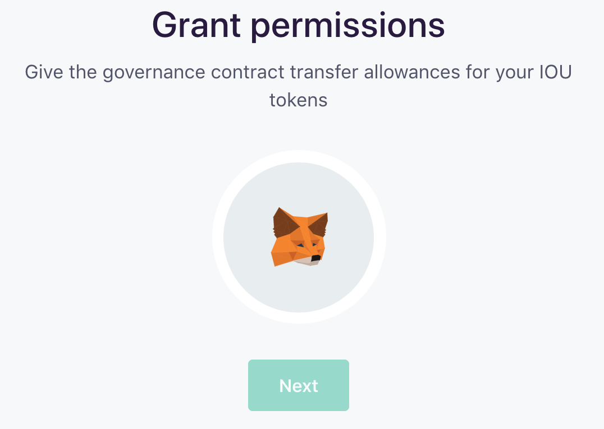
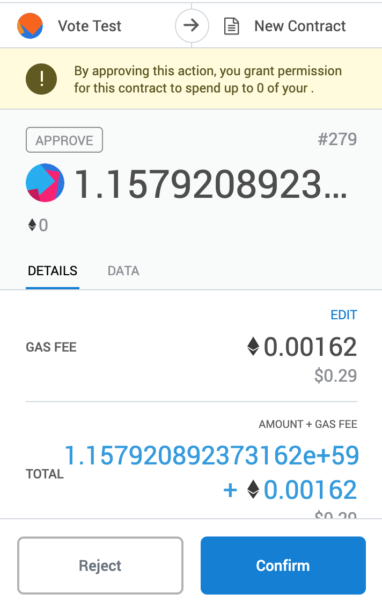
_Grant Permissions for IOU Token Transfer_

The final step is to “Lock MKR” into the voting system. Set how much MKR this contract will hold. A contract voting with more MKR has a more significant impact on the system. Lock in more MKR to top-up the Voting Contract later or withdraw locked MKR at any time with a single transaction.

_Note: See the end of this section for instructions on how to top-up the contract, withdraw MKR, or break the wallet contract._

Click “Confirm” and check to make sure the information is correct. “Confirm” again and approve the transaction on MetaMask.

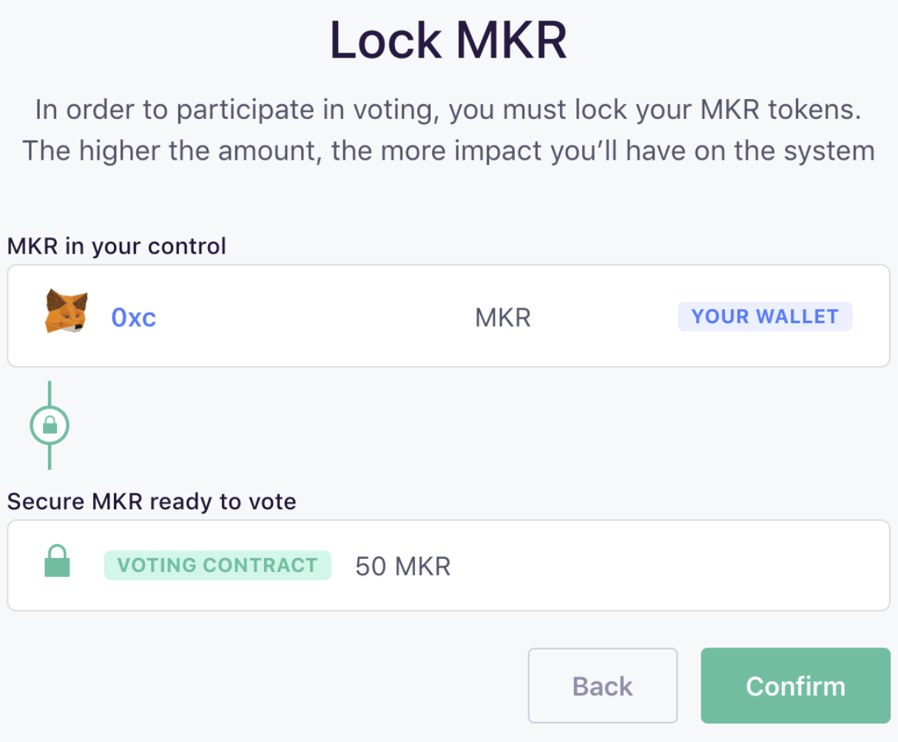
_Lock MKR_

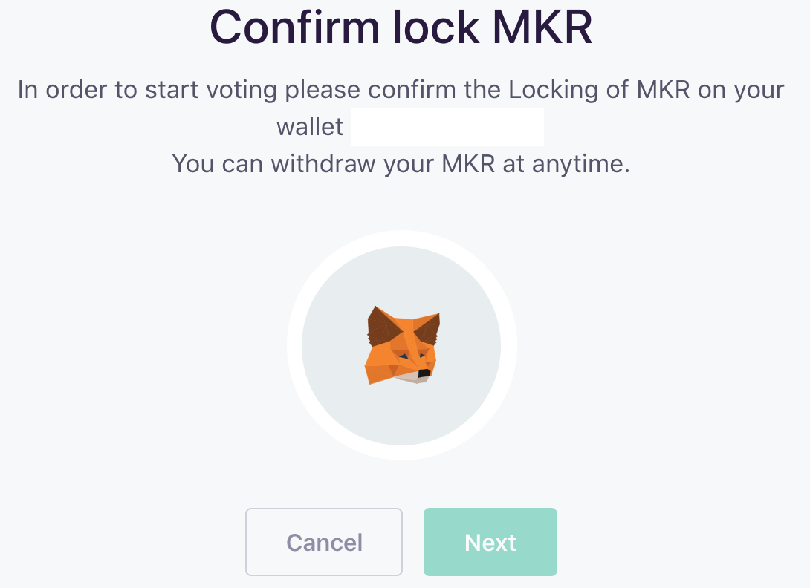
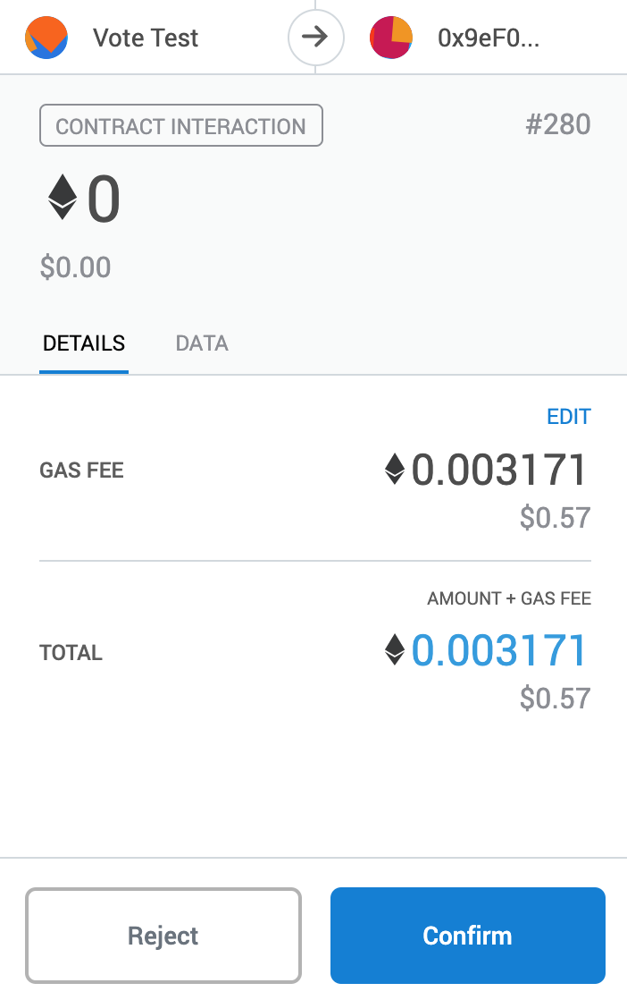
_Confirm Lock MKR_

Once MKR is locked in the contract, the Voting Contract setup is complete.

_Set Up Complete!_

Click “Start Voting” to return to the main Governance Portal to participate in Governance Polls and Executive Votes.

To begin voting, skip ahead to the [Voting Process](#the-voting-process) section.

For a video walkthrough of the Single Wallet Contract Setup, see the link below:

- [Single Wallet Walk-Through](https://www.youtube.com/watch?v=nWhLzyhZV-Q&list=PLLzkWCj8ywWP6yCPPm1IRKysNsrzg3LQ6&index=6&t=0s)

### Manage Single Wallet Voting Contract

#### Top-Up Voting Contract

To add MKR to a Single Wallet Voting Contract, make sure MetaMask is running, and the account associated with the contract is selected. On the [Governance Portal](https://vote.makerdao.com/), click “Voting Contract” to bring up the secure voting menu. Select “Top-Up Voting Contract.”

_Manage Voting Contract_

Enter the MKR amount to add to the contract and click “Lock MKR.” Approve the transaction on MetaMask.

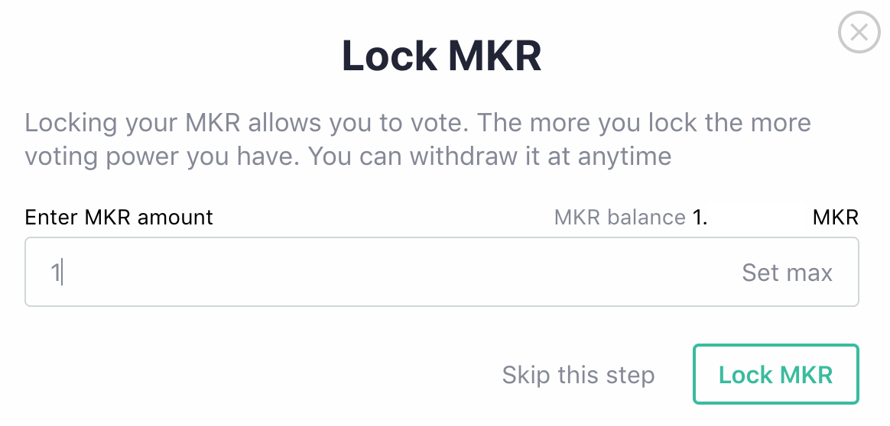
_Lock MKR_

Once the transaction is confirmed, the contract manager will reappear. The MKR balance in the voting contract will update to reflect the changes.

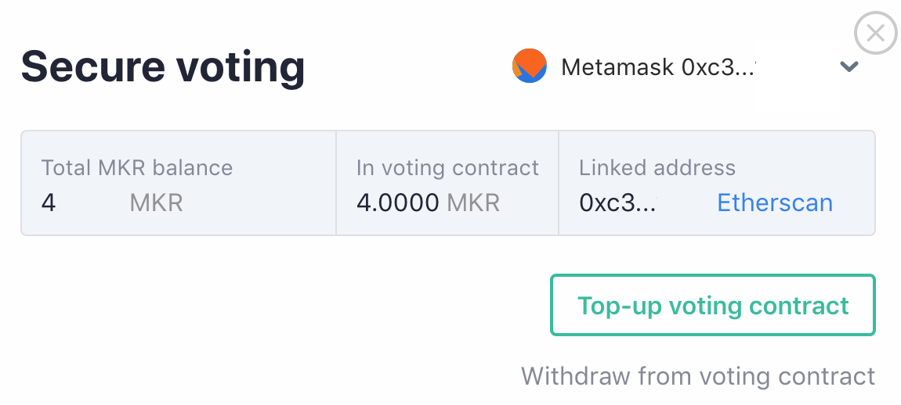
_Updated Voting Contract_

#### Withdraw MKR from Voting Contract

To withdraw MKR from a Single Wallet Voting Contract, make sure MetaMask is running, and the account associated with the contract is selected. On the [Governance Portal](https://vote.makerdao.com/), click “Voting Contract” to bring up the secure voting menu. Select “Withdraw from Voting Contract.”

_Manage Voting Contract_

Enter the MKR amount to withdraw from the contract and click “Withdraw MKR.” Approve the transaction on MetaMask.

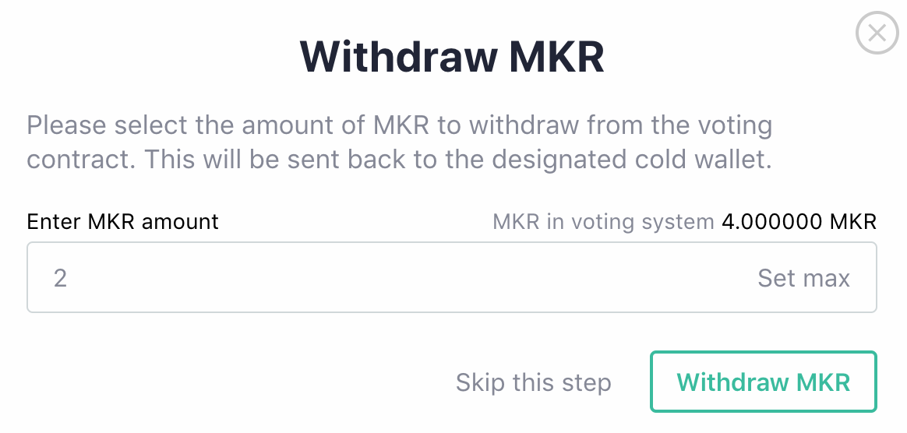
_Withdraw MKR_

Once the transaction is confirmed, unlocked MKR returns to the wallet, and the contract manager reappears. The MKR balance in the voting contract will update to reflect the changes.

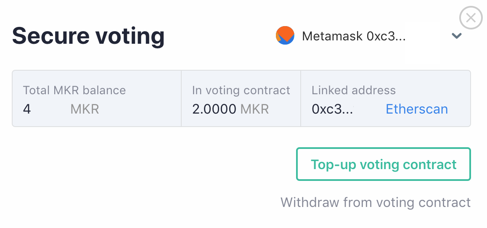
_Updated Voting Contract_

#### Close Voting Contract

For a Single Wallet Voting Contract, breaking a link is not required. To close the contract, simply withdraw all MKR back to the wallet.

To vote with the same wallet later, return to the Voting Contract manager to top-up locked MKR. The wallet will retain contract permissions. Repeating the setup process is not necessary.

## The Voting Process

Once the Voting contract is set up, return to the [Governance Portal](https://vote.makerdao.com/). Visit the “Polling” tab to participate in Governance Polls or the “Executive” tab to participate in Executive Votes.

For more information on Governance Polls and Executive Votes, click on the proposal for more details. For other frequently asked questions, visit our [Governance FAQ](../faqs/governance.md).

### Governance Polling

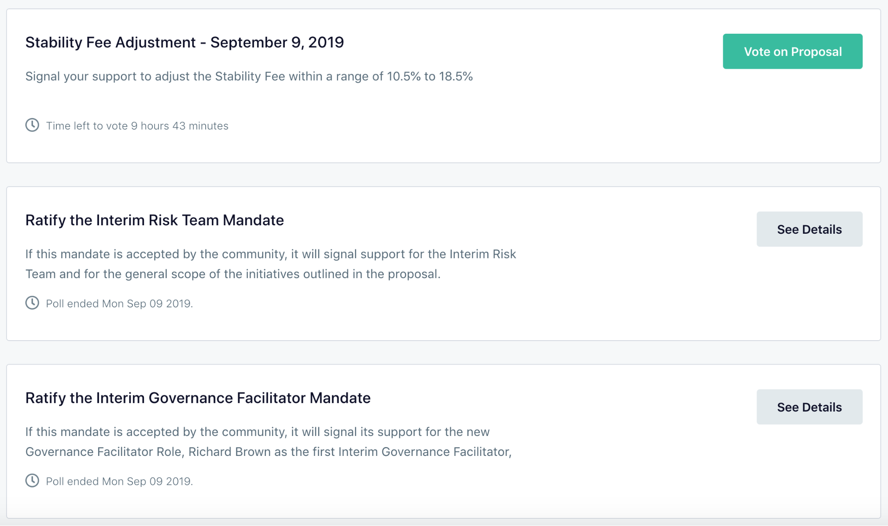
_Governance Polling_

### Executive Voting

_Executive Voting_
